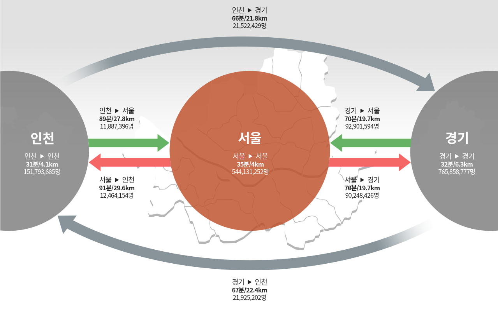
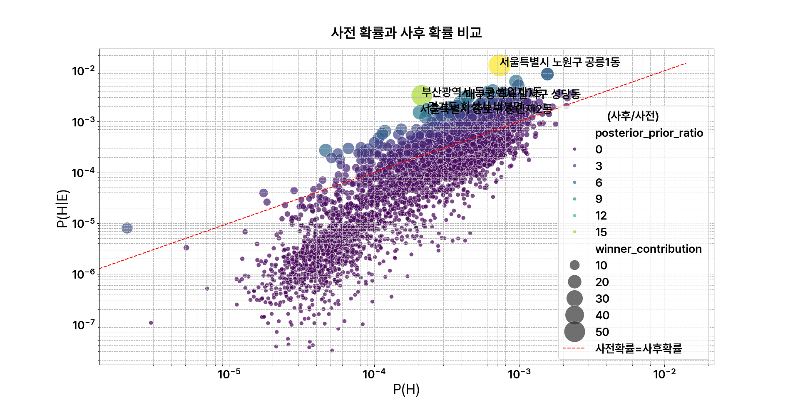
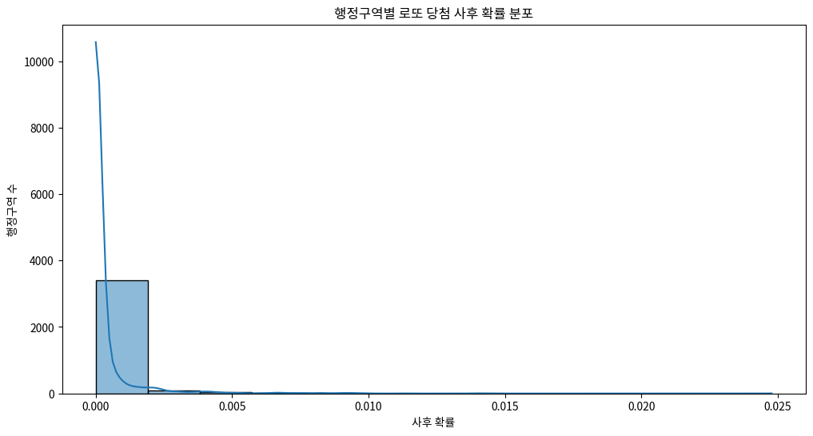
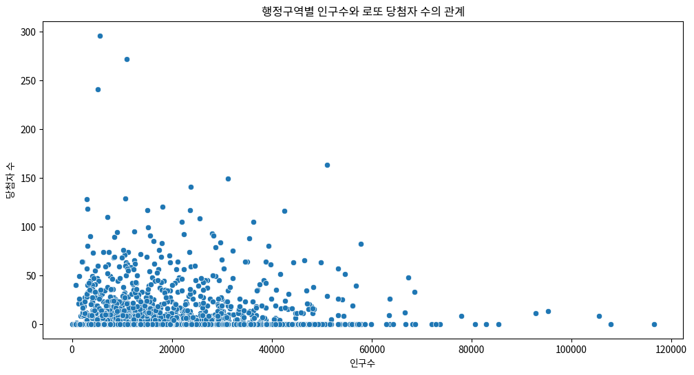
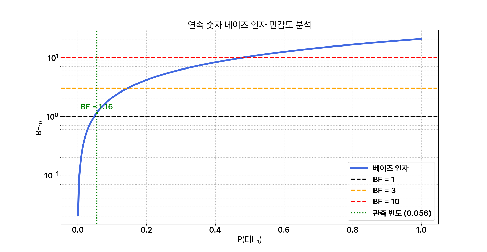
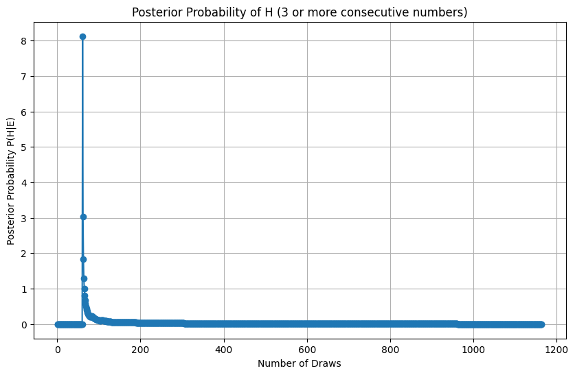
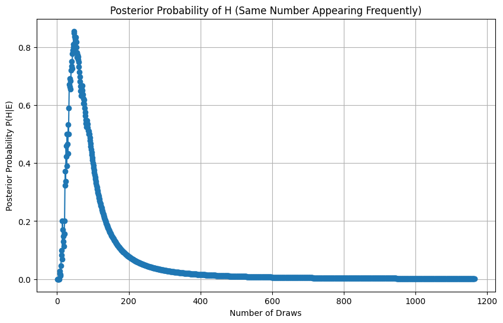

**고지.** 본 문서는 공식 제출본을 바탕으로 재구성 및 편집한 포트폴리오용
수정본이다.

::: center
**Research Question** 대표적인 로또 조작설(명당, 연속 번호, 빈출 번호)은
통계적으로 유의미한 근거를 가지는가?\
**Subject** Mathematics **Word count** 3881
:::

# 서론 (Introduction)

## 연구동기 (Motivation)

### 복권 조작설 (Manipulation Claims)

최근 인터넷 광고에서는 '복권의 패턴을 파악해' 복권의 번호를 추천해준다는
업체의 광고를 쉽게 찾아볼 수 있다. 언론에서도 복권이 특이한 패턴으로
나오거나, 많은 사람들이 당첨 되는 등 복권이 특이한 양상을 띄면 복권
번호의 특이성을 뉴스거리로 삼는다. 우리 뇌는 숫자들의 나열을 볼 때
규칙성과 상관관계를 찾는 뇌의 성향인 '클러스터링 일루전 현상'이 있는데,
무작위적인 사건인 복권 숫자들이 조작되어 '의미 있는 패턴'이 있다고
여기는 것도 클러스터링 일루전 현상일 가능성이 크다. 무작위 복권 숫자들에
상관관계를 찾고, 실제로 의미 있는 패턴이 존재하는 것으로 오인해 복권이
조작되었다고 믿는 것이다[@hoffman2024]. 복권 조작설 중 대표적인 주류
설로는 클러스터링 일루전 현상으로부터 비롯되었을 가능성이 있는 주장들인
복권에 연속된 번호가 나타난다는 주장과 같은 공이 반복적으로 나온다는
주장, 그리고 복권이 특정 지점에서 더 많이 당첨된다는 주장으로 세 가지
주장으로 분류 할 수 있다. 이 논문에서는 복권이 조작되었다는 주장들이
클러스터링 일루전 현상으로 비롯된 착각과 베이즈 사전확률을 빼고 판단해
생긴 오인인지, 혹은 실제 통계적으로 의 미가 있는 신호인지 객관적으로
확인해보기 위하여 '조작설'의 주장들을 각각 연구에서 귀무가설로 설정한 후
그 사건들이 통계적으로 충분히 일어날 수 있는 일인지, 혹은 실제로
'조작'되었는지에 대하여 알아보고자 한다. 복권 조작설은 전 세계적으로
흔한 이슈이지만, 이 연구에서는 대한민국의 6/45 로또에 한정지어 조작설의
타당성을 확률적으로 분석해 보겠다.

### 베이즈 정리 (Bayes' Theorem)

베이즈 정리는 확률론에서 조건부 확률 사이의 관계를 설명하는 정리로,
조건부확률의 방 향을 바꾸는 공식이다. A가 일어났을 때 E의 확률을 알고
있을 때 E가 일어났을 때 A의 확률을 계산하는 공식으로,
$$P(A \mid E)=\frac{P(E \mid A)P(A)}{P(E)}$$ 의 식으로 나타낸다. 베이즈
정리는 조 건부 확률의 방향을 바꾸어 사후 확률을 계산함으로써, 새로운
증거를 통해 기존의 믿음을 어떻게 변화시키는지 보여준다. 복권에 대한 기존
신뢰도를 $A$로, 복권의 신뢰도에 영향을 줄 수 있는 새로운 증거를 $E$로
정의하자. 만일 기존 알고 있던 신뢰도 $A$가 있을 때 새로운 증거 $E$가
관측될 확률인 우도 $P(E\mid A)$를 알고 있다면 조건부 확률로써 새로운
증거를 통해 보았을 때의 기존 믿음 $P(A\mid E)$를 구할 수 있는 것이다.

### 복권 추첨의 통계적 특징 (Statistical Properties)

복권의 확률을 정확히 계산해보는 과정 전, 계산 방법을 명확히 하기 위하여
우리나라 6/45 복권이 가지는 특징을 알아봄으로써 확률의 조건에 대해
알아보겠다. 본 연구에서는 복권 조작설 중에서도 대한민국의 복권,
기획재정부 산하 복권위원회가 지정한 수탁사업자인 동행복권에서 발행하는
로또 6/45의 음모론에 대해 다룬다. 로또 6/45에서는 프랑스의 'Akanis
Technologies'사에서 제작한 특수 추첨기를 사용한다. 추첨기 기계는 투명한
플라 스틱 재질로 만들어져 있어 추첨 과정 전체를 진행자와 참관자 모두
육안으로 확인할 수 있고, 각 공에 1부터 45까지의 번호가 적혀 있는 총
45개의 공이 사용된다[@gitaebu2023]. 숫 자가 있는 각 공의 무게는 4g ±
0.2g, 기준 둘레는 44.5mm ± 0.1mm의 모양을 가지고 있고, 추첨 전 경찰관
입회 하에 진행되는 둘레와 무게 검사를 통과해야 추첨에 사용될 수 있다는
조건으로 신뢰성을 확보한다[@Park2024]. 45개의 숫자 중 추첨된 6개 번호와
내가 선택한 숫자 가 일치하는 개수에 따라 등위가 결정되고, 6개의 숫자가
일치 할 시 1등 당첨이 된다("로또 6/45"). 이로 찾을 수 있는 데이터를
분석할때 유의하여야 할 복권 추첨의 통계적 특징은 균일분포, 종속사건의
특징을 가지는 것을 볼 수 있다. 각 번호가 선택될 확률이 1/45로 동일한
균일 분포를 따르며 균일분포를 가지고 있으며, 뽑은 공들을 다시 넣지
않으니 같은 회차 안에서는 공을 뺍는 행위가 종속사건이라는 통계적 특성을
가지고 있다.

### 관련 선행 연구 및 사례 분석 (Prior Work)

복권에 대한 관심도 많고 논란도 많은 만큼, 다양한 수학적 방법들을 이용해
복권의 조작 의혹을 주제로 의혹을 해소하고자 한 논문들이 상당수
존재하였다. 논문에서는 카이제곱 검정과 분산분석 테스트, 그리고 벤포드
법칙과의 상관관계 분석을 통하여 복권의 랜덤성을 증명한 선행연구를 확인할
수 있었고, 연구 결과 테스트한 24개의 특정 가설 중 대다수가 효과나 차이가
없다고 결론을 내며 귀무가설, 복권에 특정한 조작의 정황이 전혀 없다는
것을 증명하였다.

  -------------------------------------------------------------------------------------------
  분석 방법             설명
  --------------------- ---------------------------------------------------------------------
  카이제곱 적합도 검정  시계열 측정값의 관측 빈도(반복 길이 및 간격)를 이론적으로 예상되는
                        빈도와 몬테카를로 시뮬레이션 무작위 추첨에서 도출된 예상 빈도와
                        비교하였다. 데이터 독립성, 범주형 데이터, 충분히 큰 예상
                        빈도(이상적으로는 범주당 최소 5개) 등 테스트 요구 사항을 검토하였다.
                        더 높은 연속 실행(3, 4, 5)의 경우 1100회 추첨 기준 예상 빈도가 이
                        기준을 충족하지 못할 수 있음을 제시하였다.

  분산 분석(ANOVA)      45개 숫자 간 발생 빈도의 잠재적 차이를 조사하기 위해 적용되었다.
  테스트                비교를 표준화하기 위해 1100회 추첨에 걸쳐 각 번호에 대해 데이터를
                        이진 시퀀스(출현 시 1, 비출현 시 0)로 변환해 테스트하였다.

  벤포드의 법칙과의     각 추첨에서 당첨된 6개 번호의 곱의 분포를 분석하여 벤포드의 법칙과의
  상관관계              상관관계를 분석하였다.
                        $$P(D)=\log_{10}\!\left(1+\frac{1}{d}\right),\quad d=1,2,\cdots,9$$
  -------------------------------------------------------------------------------------------

  : *출처: [@jung2025]* {#tab:prior-work}

또 다른 연구로는 기획재정부가 한국정보통신기술협회(TTA) 및 서울대
통계연구소에 의뢰 한 논문이 있다. 복권 주관 기관에서 직접 조작이
불가능하다는 것을 여러 기술적인 부분과 복권 당첨의 절차를 설명하며
복권의 투명성을 설명하고 있고, 그 후에는 통계적인 분석을 진행해 당첨자가
많은 사례 발생이 가능함을 확인하고 있는 연구인데, 몬테카를로 방법 론을
이용해 검정했을 때 추첨의 동등성이 위배된다고 볼 수 없다는 가설을
유의확률이 0.482 ∼ 0.757 수준으로 귀무가설을 기각할 수 없다는 결론으로
증명해내었다(기획재정 부). 이러한 선행 연구들이 카이제곱 검정과 ANOVA 등
빈도주의적 관점에서 랜덤성을 검증한 반면, 본 연구는 베이지안 관점에서 각
조작설을 직접적인 대립 가설로 설정하고 데이터가 각 가설을 얼마나
지지하는지를 확률적으로 측정하는 베이즈 인자를 이용해 기존 연구와는 다른
각도에서 문제에 접근하고자 한다.

## 연구목적 (Objective)

복권 조작설은 단순한 복권이 조작되어 있지는 않은지에 대한 호기심을 넘어,
무작위성에 대한 오해와 확증 편향이 얽혀 사회적으로 크게 퍼진 루머이다.
상기 서술한 기존 선행 연구 들에서 이미 카이제곱 검정 등 빈도주의 통계
기법을 통해 조작설을 검증하였으나, 하지만 이러한 연구들은 '조작의 증거를
찾지 못했다'는 결론, 즉 귀무가설을 기각하지 못했다는 결론을 보였다.
수업시간 믿음을 갱신한다는 베이지안 접근법에서 출발하여 똑같이 "믿음을
갱신하는 방식 으로 복권을 볼 수 있지 않을까?" 라는 의문을 토대로 기존
연구의 해석적 한계를 극복하고 논쟁에 대한 보다 결정적인 통계적 답변을
제시하고자 한다. 이를 위해 본 연구는 베이지안 추론, 특히 베이즈 인자
분석을 핵심 연구 방법론으로 채택하였다. 베이즈 인자의 가장 큰 장점은
'조작 가설'의 유의성을 판단하는 것 뿐만 아니라 공정 가설 $H_0$과 조작
가설 $H_1$을 동등 경쟁 상대로 놓고 데이터가 가설을 더 지지하는지
직접적으로 측정해 조작의 증거가 부족하다는 결론을 넘어, 관측된 데이터가
조작 가설보다 공정 가설을 얼마나 더 지지하는 지에 대한 객관적인 결론을
내릴 수 있다는 장점이 있다[@kass1995bayesfactors]. 본 연구는 복권 번호의
규칙성과 일정 조건을 통한 특이성을 토대로 일부 사람들에 의해 의혹이 제기
되고 있는 "복권 조작론"을 해소하기 위하여 특이성을 띄는 복권 번호들이
실제로 일어날 가능성이 있는 일인지를 베이즈 정리를 활용하여 판별하기
위하여 시작되어, 현재 존재하 는 여러 복권 조작 음모론들에 대한 확률적
타당성을 베이즈 정리를 이용하여 통계적으로 검증하고, 구체적인 사례
데이터를 바탕으로 논리적 해석과 확률 모델링을 통해 각 설들에 대한
타당성을 확인해 보는 것이 본 연구의 최종적인 목표이다. 최종 목표 달성을
위하 여 "대표적인 로또 조작설(명당, 연속 번호, 빈출 번호)은 통계적으로
유의미한 근거를 가지는가?"라는 연구 질문 아래 세 가지 세부 연구 질문을
설정해 이를 바탕으로 연구를 진행하였다.

1.  로또 1등 당첨자가 특정 지역에 집중되는 현상은 해당 지역의 인구수나
    판매량 등 외적 요인을 넘어선 통계적 유의성을 가지는가?

2.  로또 당첨 번호에서 연속된 숫자가 나타나는 빈도는 순수한 무작위 추첨
    과정에서 기대되는 확률과 통계적으로 유의미한 차이를 보이는가?

3.  장기적으로 관찰했을 때, 특정 로또 번호가 다른 번호에 비해 통계적으로
    유의미하게 높은 출현 빈도를 보이는가?

# 본론 (Exploration)

## 이론적 배경 및 분석 전략 (Theory and Strategy)

### 가설 검증의 베이지안 접근법 (Bayesian Hypothesis Testing)

본 연구에서는 복권 당첨 결과에서 관찰되는 이상 현상들을 두고, 두 가지
경쟁 가설을 설정하여 데이터가 어느 쪽을 더 지지하는지 확인하고 분석한다.

- **귀무가설 $H_0$: 우연에 의한 현상** 복권 추첨은 공정하고
  무작위적이며, 특정 패턴이 나타나더라도 이는 통계적 변동의 자연스러운
  결과이다.

- **대립가설 $H_1$: 유의미한 조작** 추첨 과정에 조작과 같은 외부의
  개입이 있기 때문에 특정 패턴이 무작위로 기대되는 것과 현저히 다른
  빈도로 나타난다.

복권 추첨은 공정하고 무작위적이며 특정 패턴이 나타나더라도 이는 통계적
변동의 자연 스러운 결과라는 귀무가설 $H_0$과 추첨 과정에 조작과 같은
외부의 개입이 있기 때문에 특정 패턴이 무작위로 기대되는 것과 현저히 다른
빈도로 나타난다는 대립가설 $H_1$을 설정하여 데이터가 어느 쪽을 더
지지하는지 확인하고 분석하였다. 본격적 분석에 앞서 사후 확률 기반 베이즈
정리 접근법에 따라 세 연구를 모두 분석하고 진행하였었는데, 진행 도중
조작 가설에 대한 사전 확률 $P(H_1)$과 조작이 사실일 때 특정 패턴이
나타날 확률 $P(E\mid H_1)$이라는 두 가지 값을 가정이 충분히 객관적이지
못해 도출 된 결과를 신뢰하기 어려웠다. 기존 베이즈 정리 접근법은 사후
확률 $P(H_1\mid E)$ 계산을 목표로 한다는 점에서 연구과정에서 두번째
연구와 세번째 연구의 사전 확률이 주관에 의 해 결정되어야 했으며, 그
과정에서 결과가 사전확률 $P(H_1)$ 값에 결정적으로 의존해 최종 결과까지
신뢰하기 어려웠다. '복권이 조작되었을 것'이라는 가설에 대한 객관적인
사전 확률을 설정하는 것은 너무 주관적이며, 분석 결과까지 크게 좌우할 수
있어 두 연구에는 인자를 정해 사후확률을 직접 계산하는 것이 아니라,
데이터가 귀무가설 혹은 대립가설을 얼마나 더 강력하게 지지하는지를
측정하는 베이즈 인자를 이용해 주관적 가정의 영향을 최소화한 분석으로
진행하였다. 전통적, 사후확률 기반의 베이즈 분석이 귀무가설과 대립가설을
바탕으로 사후 확률 $P(H_1\mid E)$을 계산하는 반면, 베이즈 인자는 사전
확률의 영향을 제거하고, $E$가 $H_1$과 $H_0$ 중 어느 쪽을 얼마나 더
강하게 지지하는지를 나타내는 척도이다[@hitchcock2021bayesfactor]. 베이즈
정리에 따라 두 가설 $H_1$ 과 $H_0$ 의 사후 확률은 각각
$$P(H_1 \mid E)=\frac{P(E \mid H_1)P(H_1)}{P(E)},\quad
P(H_0 \mid E)=\frac{P(E \mid H_0)P(H_0)}{P(E)}$$ 으로 표현할 수 있으니,
데이터 $E$를 관측한 후 두 가설의 상대 적 타당성을 비교하기 위해서는 사후
확률의 비율인 사후 오즈를 계산해 비교할 수 있다.
$$\frac{P(H_1\mid E)}{P(H_0\mid E)}
=
\frac{P(E\mid H_1)}{P(E\mid H_0)}
\times
\frac{P(H_1)}{P(H_0)}$$ 여기서 우변의 첫 번째 항이 바로 베이즈 인자
$BF_{10}$ 이고 두 번째 항 $\frac{P(H_1)}{P(H_0)}$은 데이터 관측 전
가설들의 상대적 신뢰도를 나타내는 사 전 오즈로, 사후 오즈 = 베이즈 인자
$\times$ 사전 오즈와 같이 생각할 수 있다. 베이즈 인자는

$P(E \mid H_0)$일 때와 $P(E \mid H_1)$일 때를 비교해 $BF_{10}<1$이면
귀무가설 $H_0$ 을 지지하고,

반대의 경우 $H_1$ 을 지지한다.

## 방법론 (Methodology)

본 연구는 세 가지 조작설을 검증하기 위해 각각 다른 베이지안 모델을
사용해 분석하였다. 각 연구 질문의 통계적 특성이 다르기 때문에 각각에
최적의 베이지안 모델을 선택하기 위해 노력하였으며, 여러 모델들을 바꾸어
비교해보았다. 연구 1 (특정 지점 당첨)의 경우, 우선 사전확률과 사후확률을
비교하는 단순 '베이지안 접근법'으로 인구수에 의거한 당첨 확률 증가가
적절한 비율로 증가하고 있는지 분석해 보았으나 사전확률과 사후확률의
변화율에 큰 차이를 보이는 경향성을 보이는 이상치를 수학적으로 충분히
설명하지 못한다는 점을 개선하기 위하여 베이지안 계층 모델을 도입해
인구수와 당첨자 수의 관계를 모델링하여 단순 사전확률과 사후확률의
비교로서는 설명할 수 없었던 '순수 명당 효과'를 분리하여 분석하였다. 본
연구는 전국의 수많은 지역에서 발생하는 '1등 당첨'이라는 희귀 사건의 발생
빈도를 다루기 때문에, 단위 시간 또는 공간 내에서 발생하는 사건의 평균
발생 횟수를 모수로 가지며, 각 사건이 서로 독립적일 때 이용되는
이산확률변수 중 표준적으로 사용되는 포아송 분포를 이용하였다. 하지만 각
지 역의 인구수나 복권 판매량같은 공변량이 존재하고, 지역 간의 변동성을
고려해야 하므로 포아송 분포에 각 지역의 고유 효과를 추가로 모델링하고,
전체 지역의 정보를 종합하여 개별 지역의 파라미터를 추정하는 베이지안
계층 모델을 도입하였다[@pishro2024special]. 연구 2 (연속 번호 출현) 연속
번호 출연의 가설에 대해서는 각 회차의 추첨 결과가 '3개 이상 연속된
번호가 나왔는가?'라는 가설에 대한 이항적 여부를 확인하는 것이기에 문제상
황을 베르누이 시행으로 보아 모델링하였다. 알지 못하는 성공 확률 π에 대한
사전 믿음을 표현하고, 데이터를 통해 이 믿음을 갱신하는 데에는 \[0, 1\]
사이의 값을 갖는 확률 변수를 유연하게 모델링할 수 있으며, 베르누이
우도와 결합했을 때 사후분포 또한 베타 분포가 되어 계산과 해석이
용이하다는 장점이 있는 베타 분포를 켤레 사전분포로 두었다.
[@orloff2018conjugate] 연구 3 (특정 번호 빈출)은 2개의 범주를 넘어
45개의 번호라는 다수의 범주에 대한 출현 빈도를 다루기 때문에, 베르누이
분포를 K개의 범주로 일반화한 다항분포로 모델링하였 고, 그 중 각 번호가
뽑힐 확률 벡터 p⃗ = (p1 , . . . , p45 )에 대한 사전분포로는, 베타 분포를
다차원으로 일반화한 디리클레 분포를 사용하였다. 연구를 위해 데이터로는
동행복권 홈페 이지에서 지난 기록들과 회차별 당첨 지점을("당첨 판매점"),
그리고 행정안전부 주민등록 인구통계 에서 각 행정구역별 인구 수("행정동별
주민등록")를 가져와 분석 데이터로 이용 하였다.

## 결과 분석 및 모델링 (Results and Modeling)

### 가설 1: 로또 1등 당첨자가 특정 지역에 집중되는 현상은 해당 지역의 인구수나 판매량 등 외적 요인을 넘어선 통계적 유의성을 가지는가?

#### (i) 사전확률-사후확률 비교

명당이 존재하는지 확인해보기 위하여 첫번째 방법으로 각 지역별 사전확률과
사후확률을 지역별로 고른 다음, 각 지역별 사전확률과 사후확률간의 산포도
그래프를 그린 후 그 관계를 확인하였다. 아래 그래프는 서울 데이터허브에서
캡처한 사진으로, 2025년 6월 기준 지난 1년간 인구 유출/유입 수를 나타내는
그림으로, 유동인구의 이동 거리가 30km까지 존재한다는 것을 볼 수
있다([1](#fig:commute){reference-type="ref+Label"
reference="fig:commute"}). 이 자료를 바탕으로 인천에서 서울로 통근할 시
30km가량을 이동한다는 서울데이터허브의 데이터("서울 시민의 일상") 를
토대로 30km 반경 내 인구가 올 수 있다고 가정한 후, 구매자 중 70%가량이
지역에서 구매한 사람일 것이라고 가정하고, 거리에 따라 가우시안 분포 (σ =
15km)로 영향력이 감소한다는 가정에 기반해 계산한 후 계산 결과를 산포도를
이용하여 시각화하였다.

<figure id="fig:commute" data-latex-placement="htbp">

<figcaption><em>출처: “서울 시민의 일상, 이동으로 읽다”, 서울데이터허브,
2023.</em> <a href="https://data.seoul.go.kr/bsp/wgs/theme/detail/1.do"
class="uri">https://data.seoul.go.kr/bsp/wgs/theme/detail/1.do</a></figcaption>
</figure>

<figure id="fig:myungdan" data-latex-placement="htbp">

<figcaption>인구수 기반 기대 당첨 확률 대비 실제 당첨 데이터를 반영한
사후 확률 산포도 그래프 (matplotlib 이용)</figcaption>
</figure>

[2](#fig:myungdan){reference-type="ref+Label"
reference="fig:myungdan"}에서 x축은 인구수 기반의 사전확률 $P(H)$, y축은
당첨자 데이터를 반영한 사후확률

$P(H \mid E)$을 나타낸다. 대부분의 지역은 사전확률과 사후확률이 일치하는
$y=x$ 근처에

분포하는 경향성을 보였지만, 고르게 $y=x$ 함수 근처에 분포하는 것이
아니라 사전확률이

$10^{-4}$ 가량일 시 사전확률에 비해 사후확률이 많이 떨어지는 것을 볼 수
있었고, 사전확률이

크면 사후확률이 더 커지며 전체적인 기울기가 y = x의 기울기보다 큰
경향성을 보였다. 이상치로는 사전확률에 비해 사후확률이 눈에 띄게 큰 특정
지역들이 존재하였다. 사전확 률에 비해 사후확률이 가장 큰 5개의 지역들은
그래프에 표시하였는데, 그 지역은 순서대로 서울특별시 노원구 공릉1동,
부산광역시 동구 범일제1동, 서울특별시 종로구 숭인제2동, 경 기도 화성시
비봉면이 있었다. 왜 이 지역들이 이상치가 되었을지 확인해보기 위하여 가장
큰 이상치였던 노원구부터 살펴본 결과, 노원구는 서울에서 인구 감소율이
가장 큰 특징을 가지며 10년간 인구가 15.2%나 줄었다는 특징이
있었으며[@kim2024nodogang], 전국 최대의 '복권 명 당'이라고 알려진 곳이
노원구에 존재해 특정 판매점에 새벽부터 밤까지 사람들이 붐볐고, 부산에서
4시간, 대구에서 3시간 걸려 그 지점을 찾아온 사람도 많았다고
한다[@yoo2022lotto]. 이로 인해서 지역 사람들이 70% 이용할 것이라는
가설을 방해하고, 명당이라는 소문으로 인해 사람들이 더욱 더 붐비지만
오히려 거주자의 감소폭이 커 '거주자의 숫자가 복권 구매 건수를 대변할
것'이라는 가설을 방해하며 사후확률이 지나치게 커졌을 것이다. 부산광역시
동구 범일제1동과 다른 지역들 또한 언론에 자주 보도되는 전국 단위의 유명
복권 판매점이 위치한 곳과 일치하는 경향을 보였다. 이러한 판매점들은 해당
지역 상주인구뿐만 아니라, 원정 구매나 온라인 구매 대행 등을 통해 전국의
판매량을 흡수해 인구수라는 대리 변수가 실제 판매량을 온전히 반영하지
못해 이상치가 되어 이상치의 원인이 실제 통계적 조작 때문인지, 아니면
소문으로 인한 판매량 쏠림 때문인지 명확히 구분할 수 없었다. 이런 거주
인구와 실제 복권 구매량 사이의 불완전한 관계를 통제하지 못한다는 점과
언론에 의해 '명당'으로 알려져 인기있는 판매점은 지역 인구와 무관하게
외부 구매자를 끌어들여 판매량을 왜곡시킬 것이며, 가우시안 분포를 이용한
거리 가중치 부여 가정이 주관적이 었기 때문에 이러한 문제점들을 극복하고
변수들의 영향을 분리하여 분석하기 위해, 다음 절에서는 인구수와 당첨자
수의 관계를 직접 모델링하는 베이지안 계층 모델을 도입하였다.

#### (ii) 포아송 계층 모델을 이용한 분석

설명할 수 없는 분포에 대한 이유를 밝혀 분석의 정밀도를 높이기 위해
베이지안 계층 모델을 사용하여 지역별 당첨자 수에 영향을 미치는 요인을
분해해 분석하기 위해 계층 모델을 이용하였다. 앞서 인구수와 복권의 수의
관계 에서 벗어난 이상치들로 신뢰하기 어려웠던 분석의 한계를 극복하고
인구 효과를 통제한 후에도 남는 지역 고유의 '순수 명당
효과'($\epsilon_j$)가 통계적으로 유의미한지 측정하였다. 모델 은 다음과
같이 3개의 층으로 구성된다.

1.  데이터 층: 지역 $j$의 1등 당첨자 수 $W_j$는 1등 당첨과 같이 드물게
    발생하는 사건의 횟 수를 모델링하는 데 적합한 모델을 이용하기 위하여
    해당 지역의 평균 기대 당첨률 $\lambda_j$를 모수로 갖는 포아송 분포를
    따른다고 가정하였다.

    $$W_j \sim \mathrm{Poisson}(\lambda_j)$$

2.  프로세스 층: 평균 당첨률 $\lambda_j$는 지역의 인구수 $P_j$에 따라
    결정된다고 보고, 그 관계를 로그-선형 모델로 표현한다.

    $$\begin{equation}
    \log(\lambda_j)=\alpha+\beta\log(P_j)+\epsilon_j
    \end{equation}$$

    여기서 $\alpha$는 전국 공통의 기준 당첨률, $\beta$는 인구수가
    당첨률에 미치는 영향, 그리고 $\epsilon_j$는 인구 효과로 설명되지
    않는 지역 j만의 고유 효과인 순수 명당 효과를 나타낸다.

3.  계층 층: 모델의 핵심은 각 지역의 고유 효과 $\epsilon_j$들이 완전히
    독립적이지 않고, '대한민국' 이라는 전체 집단의 공통된 분포에서
    추출된 표본이라고 가정해 데이터가 부족한 지역의 효과 $\epsilon_j$가
    우연에 의해 과대평가되는 것을 막고, 전체 데이터의 정보를 활용하여
    추정치를 보정하는 통계적 축소 효과를 통해 분석의 안정성을 높였다.

    $$\begin{equation}
    \epsilon_j \sim \mathrm{Normal}(0,\sigma_\epsilon^2)
    \end{equation}$$

이 모델의 사후분포는 MCMC(Markov Chain Monte Carlo) 시뮬레이션을 통해
추정하였 다. 본격적인 결과 분석에 앞서,
[3](#fig:trace){reference-type="ref+Label" reference="fig:trace"}의
트레이스 플롯을 통해 MCMC 시뮬레이션이 안정 적으로 수렴했는지 우선적으로
확인하였다. MCMC의 구체적인 방식으로는 깁스 샘플링을 사용해 각
파라미터를 나머지 파라미터가 모두 주어졌을 때의 조건부 분포를 반복적으로
추출하였다.

<figure id="fig:trace" data-latex-placement="htbp">

<figcaption>주요 모델 파라미터의 트레이스 플롯 (matplotlib
이용)</figcaption>
</figure>

각 파라미터에 대해 왼쪽은 사후 분포를, 오른쪽은 MCMC 체인의 이동 경로를
보여준다 ([3](#fig:trace){reference-type="ref+Label"
reference="fig:trace"}). 오른쪽의 트레이스 플롯에서 4개의 체인이 서로 잘
섞여 특정한 패턴을 가지지 않 는다는 것은 시뮬레이션이 성공적으로
수렴했음을 나타내는 것으로 이어지는 분석 결과가 통계적으로 신뢰할 수
있다는 것을 확인해 시뮬레이션의 안정성을 확인하였다. MCMC 시뮬레이션을
통해 추정한 $\sigma_\epsilon$의 사후분포는
[4](#fig:sigma){reference-type="ref+Label" reference="fig:sigma"}와
같다.

<figure id="fig:sigma" data-latex-placement="htbp">

<figcaption>순수 명당 효과 <em>σ</em><em>ϵ</em>의 사후분포
(matplotlib 이용)</figcaption>
</figure>

[4](#fig:sigma){reference-type="ref+Label" reference="fig:sigma"}는
모델의 최종 결론, 즉 '순수 명당 효과'의 전체적인 크기
$\sigma_\epsilon$가 0에 매우 가깝다는 것을 보여준다.
[5](#fig:shrink){reference-type="ref+Label" reference="fig:shrink"}는 이
결론이 어떻게 도출되었는지를 시각적으로 설명한다. 이 그래 프는 모델이 각
지역의 실제 당첨 효과의 기여도를 어떻게 통계적으로 보정하는지를 명확히
보여준다.

<figure id="fig:shrink" data-latex-placement="htbp">

<figcaption>베이지안 계층 모델의 축소 효과 (matplotlib
이용)</figcaption>
</figure>

[5](#fig:shrink){reference-type="ref+Label" reference="fig:shrink"}에서
위쪽 그래프는 모델 적용 전의 원시 효과 $\epsilon$를, 아래쪽 그래프는
모델이 전국 데이터를 함께 고려하여 보정한 후의 축소된 효과를 보여준다.
X축은 인구수의 로그 스케 일이다. 인구가 적은 지역일수록 효과로 나타나는
영향이 극단적이었지만 모델 보정 후에는 그 효과가 0에 가깝게 강력하게
축소되는 것을 볼 수 있었 다. 최종적으로 아래 그래프에서 모든 지역의 순수
명당 효과는 0을 중심으로 매우 좁은 범위에 분포하므로, 통계적으로
유의미한 '명당'은 존재하지 않는다는 결론을 뒷받침한다는 것을 확인할 수
있었다. 결과적으로 $\sigma_\epsilon$의 94% 신뢰구간은 0을 명확하게
포함했다는 것으로 데이터가 $\sigma_\epsilon=0$이라는 더 단순한 가설인
'순수 명당 효과'가 없다는 것을 전혀 반박하지 못함을 확인할 수 있었고,
따라서 관측된 지역별 당첨자 수의 차이는 대부분 인구의 차이와 통계적
잡음으로 설명될 수 있으며, 인구 효과를 넘어선 통계적으로 유의미한 '명당
효과'는 존재하지 않는다는 것을 확인할 수 있었다.

### 가설 2: 로또 당첨 번호에서 연속된 숫자가 나타나는 빈도는 순수한 무작위 추첨 과정에서 기대되는 확률과 통계적으로 유의미한 차이를 보이는가?

번호가 연속적으로 나오는지 확인할 이론적 확률 $\pi_0$ 는 3개 이상의
연속된 숫자를 포함하는 경우의 수는 전체의 경우에서 3 이상이 각각
중복되는 것들을 뺌으로써 구할 수 있다. 다음과 같은 조합론 계산으로 유효
경우의 수를 얻을 수 있다.
$$493{,}640-(34{,}440+820)-(1{,}640+40)-40=459{,}980$$

따라서 총 유효 경우의 수는 $459{,}980$가지로, 이를 전체 경우의 수
$$\binom{45}{6}=8{,}145{,}060$$ 으로 나누면 이론적 확률은 다음과 같다.

$$\pi_0=\frac{459{,}980}{8{,}145{,}060}\approx 0.0565$$

총 1164회의 추첨 데이터를 분석한 결과, 3개 이상의 연속된 번호가 포함된
경우는 총 65 회로, 관측 빈도는 약 $\frac{65}{1164}=5.58\%$였다. 한편,
조합론적 계산을 통해 얻은 이론적 확률 $H_0$ 은 약 5.65%이다. 우리는
관측된 빈도 5.58%가 이론적 확률 5.65%와 통계적으로 유의미하게 다른지
검증하고자 한다. 각 로또 추첨은 연속 번호가 나왔는지 혹은 나오지
않았는지에 대한 두 가지 결과만을 가 지는 단일 시행이기 때문에 추첨을
베르누이 분포로 설명할 수 있다. 각 로또 추첨을 성공 또는 실패의 결과만
갖는 독립적인 베르누이 시행으로 간주하고. 우리가 정말 궁금한 것은 이
동전의 실제 편향, 즉 연속 번호가 나올 진짜 확률 $\pi$이다. 베이즈
통계에서는 이 미지의 확률 $\pi$에 대한 우리의 불확실성을 수학적으로
표현하기에 0과 1 사이의 확률값을 표현하는 데 매우 유연하며, 베르누이
분포와 짝을 이루어 계산을 용이하게 하는 켤레 사전분포인 베타 분포를
사용하여 모델링하였다.[@orloff2018conjugate]. 먼저, 조작 가설 $H_1$
하에서 관측 데이터 $D$가 나타날 총체적인 확률, 즉 주변 우도
$P(D \mid H_1)$ 를 계산하기 위해서 이를 특정 성공 확률 $\pi$를 가정하는
대신 유도된 공식을 사용하여, 공정 가설의 확률 $P(D \mid H_0)$과 조작
가설의 확률 $P(D \mid H_1)$을 수치적으로 계산하고, 이 두 모든 가능한
$\pi$ 값에 대해 데이터가 나올 확률을 전부 고려해서 평균을 구하였다. 조작
가설 $H_1$ 하에서의 주변 우도 $P(D \mid H_1)$는 다음과 같은 적분으로
정의된다. 데이터 $D$ 는 총 $N=1164$번의 시행 중 $k=65$번의 성공이 관측된
사건을 의미한다.

$$P(D\mid H_1)=\int_0^1 P(D\mid \pi,H_1)\,P(\pi\mid H_1)\,d\pi$$

여기서 우도 함수 $P(D\mid \pi, H_1)$는 성공 확률이 $\pi$일 때 $N$번의
독립적인 베르누이 시행에서 $k$ 번의 성공을 관측할 확률이므로, 이항분포의
확률질량함수(PMF)인 $$\binom{N}{k}\pi^k(1-\pi)^{N-k}$$ 이다. 조작 여부나
방식에 대한 사전 정보가 없음을 가정하여 사용하는 균일 사전분포
$P(\pi \mid H_1)$ 는 $\mathrm{Beta}(\pi\mid 1,1)$로, 이는 구간
$[0,1]$에서 값이 1인 상수 함수와 같다. 이를 대입하여 식을 전개하면
다음과 같다.

$$\begin{align}
P(D\mid H_1)
&=\int_0^1 \binom{N}{k}\pi^k(1-\pi)^{N-k}\cdot 1\,d\pi \\
&=\binom{N}{k}\int_0^1 \pi^k(1-\pi)^{N-k}\,d\pi
\end{align}$$

위 식의 적분 항은 베타 함수 $B(a,b)$의 정의인
$$B(a,b)=\int_0^1 t^{a-1}(1-t)^{b-1}\,dt$$ 와 직접적으로 대응된다.
여기서 $a-1=k$, $b-1=N-k$이므로, $a=k+1$과 $b=N-k+1$로 치환할 수 있다.
따라서 적분 항은 $B(k+1,N-k+1)$과 같다. 베타 함수는 감마 함수
$\Gamma(n)=(n-1)!$ 를 이용하여 $\frac{\Gamma(a)\Gamma(b)}{\Gamma(a+b)}$
로 표현할 수 있으므로, 전체 식은 다음과 같이 계산할 수 있다.

$$\begin{align}
P(D\mid H_1)
&=\binom{N}{k}B(k+1,N-k+1) \\
&=\frac{N!}{k!(N-k)!}\cdot\frac{\Gamma(k+1)\Gamma(N-k+1)}{\Gamma(N+2)} \\
&=\frac{N!}{(N+1)!}=\frac{1}{N+1}
\end{align}$$

이로써 데이터가 주어졌을 때 조작 가설의 주변 우도가
$\frac{1}{N+1}$이라는 간결한 형태로 도출된 다. 이로써 $N=1164$일 때,
조작 가설의 주변 우도는 $P(D\mid H_1)=\frac{1}{1165}$라는 간결한 형태로
도출된다. 이러한 사전분포의 선택은 베이지안 분석에서 중요한 부분이다. 본
연구에서는 특정 $\pi$ 값 에 대한 선호를 전혀 표현하지 않는 사전분포를
선택하기 위하여 균일 사전분포 $\mathrm{Beta}(1,1)$ 를 이용하였다. 이
적분은 베타 함수
$B(a,b)=\int_0^1 t^{a-1}(1-t)^{b-1}dt=\frac{\Gamma(a)\Gamma(b)}{\Gamma(a+b)}$를
이용하여 해석적으로 계산할 수 있다. 균일 사전분포 $a=1, b=1$를 사용한
이항 우도 의 적분 결과는 $\frac{1}{N+1}$이라는 잘 알려진 공식을
따르므로, $P(D\mid H_1)=\frac{1}{1165}$이라 는 값을 얻는다. 이 두 값을
계산하여 베이즈 인자를 구한 결과, 공정 가설을 지지하는

$BF_{01}=P(D\mid H_0)/P(D\mid H_1)$ 값은 29.80으로 나타났다. 일반적으로
베이즈 인자 $BF_{01}$ 가

10-30 사이일 경우 '강력한(strong)' 증거, 30-100 사이일 경우 '매우
강력한(very strong)' 증거로 해석할 수 있으니, [@koo2019bayes]
29.80이라는 값은 데이터가 조작 가설 $H_1$ 보다 공정 가설 $H_0$ 을
지지하는 강력한 증거를 제공함을 의미한다.

<figure id="fig:consecutive" data-latex-placement="htbp">

<figcaption>연속 번호 출현 확률에 대한 확률 밀도 (matplotlib
이용)</figcaption>
</figure>

[6](#fig:consecutive){reference-type="ref+Label"
reference="fig:consecutive"}은 연속 번호 출현 확률에 대한 확률 밀도를
나타낸 그래프로, 공정 가설을 지지하는 베이즈 인자 $BF_{01}$ 가 58.97으로
도출되며 조작설을 매우 강하게 기각하였다. 이 분석을 통해 서는 복권
데이터가 조작 가설보다 공정 가설을 약 60배가량 더 강력하게 지지하며,
조작이 없다는 귀무가설을 매우 강력하게 지지하는 것을 확인할 수 있었으며,
따라서 결론적으로 관측된 5.58%라는 빈도는 이론적 확률 5.65%와의 차이가
통계적 우연의 범위 내에 있음을 확인할 수 있다.

### 가설 3: 장기적으로 관찰했을 때, 특정 로또 번호가 다른 번호에 비해 통계적으로 유의미하게 높은 출현 빈도를 보이는가?

총 1164회 추첨에서 각 회차당 6개의 번호가 나왔으므로, 총
$1164\times 6=6984$개의 번호가 추첨되었다. 공정 가설 $H_0$ 하에서 각
45개 번호의 기대 출현 횟수는 $\frac{6984}{45}\approx 155.2$회이다. 실제
데이터에서는 번호별로 130회에서 180회 사이의 출현 빈도를 보여 이 관측된
빈도 분포가 균등 분포에서 나타날 수 있는 자연스러운 변동인지, 아니면
통계적으로 유의미한 편차인지 확인하였다. 이 문제는 2개를 초과하는 여러
범주를 갖는 사건을 가지며, 이에 여기의 발생 빈도는 이항 분포를 일반화한
다항분포로 모델링할 수 있다. 위 가설증명과 마찬가지로 각 번호가 나올
확률 벡터 $\bm{p}$에 대한 우리의 불확실성을 표현하기 위한 분포로 베타
분포를 일반화한 디리클레 분포를 가정하였다. 디리클레 분포는 여러 확률의
합이 1이 되어야 한다는 제약 조건을 만족시키는 확률 벡터를 모델링하는 데
최적화된 켤레 사전분포이다[@builtin2025dirichlet]. 45개의 출현 확률을
모두 미지수로 두는 조작 가설 $H_1$ 하에서의 주변 우도 $P(D\mid H_1)$를
계산해 모든 가능한 확률 벡터 $\bm{p}$에 대해 다차원 적분을 수행하기 위해
프로그래밍하였다. 수학적 모델링은 45개의 범주를 갖는 사건의 발생 빈도를
다루므로, 이항분포를 다차원 으로 확장한 다항-디리클레 모델이 적합하다.
데이터 생성 과정은 관측 횟수 벡터 $\bm{O}$

$(O_1,\ldots,O_K)$와 확률 벡터 $\bm{p}=(p_1,\ldots,p_K)$를 갖는
다항분포로 모델링하여 다음과 같은

우도를 얻는다.
$$P(D\mid \bm{p})=\frac{N!}{\prod_{i=1}^K O_i!}\prod_{i=1}^K p_i^{O_i}$$

공정 가설 $H_0$ 의 우도는 모든 $p_i$ 가 $1/45$로 고정된 값으로 계산한다.
반면 조작 가설 $H_1$ 은 확 률 벡터 $\bm{p}$가 미지수라고 가정하고, 이에
대한 사전분포로 대칭 디리클레 분포 $\mathrm{Dirichlet}(\bm{p}\mid$

$1,\ldots,1)$를 사용하여 주변 우도를 계산한다. 주변 우도는 모든 가능한
확률 벡터 $\bm{p}$에 대해

우도를 적분하여 구하며, 다음과 같이 정의된다.

$$P(D\mid H_1)=\int_{\mathcal{S}_K} P(D\mid \bm{p})P(\bm{p}\mid H_1)\,d\bm{p}$$

먼저, 조작 가설 하의 사전분포 $P(\bm{p}\mid H_1)$는 모든 파라미터가 1인
대칭 디리클레 분포이므 로, 그 확률 밀도 함수는 다음과 같다.

$$P(\bm{p}\mid H_1)=\frac{\Gamma\!\left(\sum_{i=1}^K 1\right)}{\prod_{i=1}^K\Gamma(1)}
\prod_{i=1}^K p_i^{1-1}
=\frac{\Gamma(K)}{\Gamma(1)^K}=(K-1)!$$

이를 주변 우도 적분식에 대입하면,

$$\begin{align}
P(D\mid H_1)
&=\int_{\mathcal{S}_K}\frac{N!}{\prod_i O_i!}\prod_i p_i^{O_i}\cdot (K-1)!\,d\bm{p} \\
&=\frac{N!(K-1)!}{\prod_i O_i!}\int_{\mathcal{S}_K}\prod_i p_i^{O_i}\,d\bm{p}
\end{align}$$

여기서 적분 항은 다변수 베타 함수 $B(\bm{\beta})$의 정의
$$B(\bm{\beta})=\int_{\mathcal{S}_K}\prod_{i=1}^K p_i^{\beta_i-1}\,d\bm{p}
=\frac{\prod_{i=1}^K\Gamma(\beta_i)}{\Gamma\!\left(\sum_{i=1}^K\beta_i\right)}$$
와 직접적으로 대응한다. 여기서 $\beta_i=O_i+1$로 설정하면, 해당 적분
항은 $B(O_1+1,\ldots,O_K+1)$ 과 같음을 확인할 수 있다.

$$\int_{\mathcal{S}_K}\prod_{i=1}^K p_i^{O_i}\,d\bm{p}
=B(O_1+1,\ldots,O_K+1)
=\frac{\prod_i \Gamma(O_i+1)}{\Gamma\!\left(\sum_i (O_i+1)\right)}
=\frac{\prod_i O_i!}{\Gamma(N+K)}$$

이를 다시 대입하여 최종적으로 주변 우도를 계산하면 다음과 같다.
$$P(D\mid H_1)=\frac{N!(K-1)!}{(N+K-1)!}$$ 여기서 $N=6984$는 총 시행
횟수, $K=45$는 범주의 수이다. 연구 2와 마찬가지로, 여기서도 사전분포의
선택이 결과에 미치는 영향을 고려해야 한다. 본 연구에서 사용된 대칭
디리클레 분포 $\mathrm{Dirichlet}(1,\ldots,1)$는 모든 가능한 확률 벡터
$\bm{p}$에 대해 동등한 사전 확률을 부여하는, 즉 사전 정보를 최소화하는
합리적인 선택이다[@builtin2025dirichlet]. 만약 특정 번호들이 더 선호될
것이라는 약한 믿음을 반영하여 다른 대칭 사전분포를 사용하더라도,
$N=6984$라는 방대한 데이터를 통해 사전분포의 영향은 거의 사라져 데이
터가 압도적으로 균등분포 가설을 지지하기 때문에 합리적인 범위 내의 어떤
사전분포를 선택하더라도 베이즈 인자가 무한대에 가깝다는 최종 결론은
변하지 않는다는 것으로 분석 결과의 강건성을 확인할 수 있었다. 이 두 값을
계산하여 베이즈 인자를 구한 결과, 공정 가설을 지지하는 $BF_{01}$ 값은
컴퓨터로 계산 가능한 범위를 초과하는 사실상 무한대에 가까운 값으로
도출되었다.

<figure id="fig:frequency" data-latex-placement="htbp">

<figcaption>복권 번호별 출현 빈도 (matplotlib 이용)</figcaption>
</figure>

이는 관측된 번호별 출현 빈도 데이터가 균등 확률을 가정한 다항분포에서
나온 매우 전형적 인 표본이지만, 균등하지 않은 확률분포에서는 극히
이례적인 표본이라는 뜻으로, 데이터는 조작 가설을 반박하고 공정 가설을
결정적으로 지지한다는 것을 계산을 통해 도출해낼 수 있었다.

# 결론 (Conclusion)

본 보고서는 '대표적인 로또 조작설(명당, 연속 번호, 빈출 번호)은
통계적으로 유의미한 근거를 가지는가?'라는 탐구 질문 아래 대한민국 로또
6/45와 관련된 세 가지 주요 조작설 의 수학적 타당성을 베이지안 모델링을
통해 검증하였다. 연구 과정에서 초기 분석 모델의 한계를 파악하고, 각
가설의 통계적 특성에 더 적합한 정교한 모델을 단계적으로 적용한 결과 세
가지 조작설 모두 통계적 유의성을 가지지 않았으며, 관찰된 현상들은 모두
무작위 뽑기 과정의 우연으로 설명 가능함을 확인할 수 있었다. 첫번째 가설
'로또 1등 당첨자가 특정 지역에 집중되는 현상은 해당 지역의 인구수나
판매량 등 외적 요인을 넘어선 통계 적 유의성을 가지는가?'에서는 베이지안
계층 모델을 적용시켜 "인구 효과를 통제할 경우, 특정 지역 고유의 당첨
확률 증가 효과($\epsilon_j$)는 통계적으로 유의미하지 않다"는 결론을 도출
하며 명당이 없음을 확인함에 더불어 왜 '명당'이라고 불리는 곳들이 명당이
되었는지까지 확인해 특정 지점들이 언론 보도나 사회적 통념에 의해
판매량이 집중된다는 외적 요인을 확인했고, 이를 해결하기 위하여 베이지안
계층 모델을 이용하여 여러 변수들이 복합적으 로 작용하는 현실을
모델링하며 순수 명당 효과와 교란 변수인 인구 및 판매량의 영향을
분리하여, 정밀한 분석이 이루어질 수 있었다. 두번째 가설 '로또 당첨
번호에서 연속된 숫자가 나타나는 빈도는 순수한 무작위 추첨 과정에서
기대되는 확률과 통계적으로 유의 미한 차이를 보이는가?'와 '장기적으로
관찰했을 때, 특정 로또 번호가 다른 번호에 비해 통계적으로 유의미하게
높은 출현 빈도를 보이는가?'에 대하여 논의하기 위해서는 베이즈 인자를
분석해 데이터가 조작 가설보다 공정 가설을 압도적으로 지지함을 정량적으로
입증 하며 귀무가설을 기각하지 못한다는 전통적 빈도주의 통계의 한계를
넘어, 데이터가 특정 가설을 다른 가설에 비해 객관적으로 몇 배 더
지지하는가를 직접적인 확률 비율로 연속 번호와 같은 패턴의 등장이
비정상적인 현상이 아니라 오히려 무작위 과정이 정상적으로 작동하고 있음을
보여주는 자연스러운 결과임을 직접적으로 확인하였다. 각 조작설에 대해
가설의 수학적 구조에 최적화된 베이지안 모델을 적용하여 통계적 근거를
평가하기 위해 첫번째 가설의 명당 분석에서는 계층 모델을 통해 변수를
분리했고, 두번째와 세번째 분 석에서는 베이즈 인자를 통해 가설 간의
증거력을 직접 비교하는 방법론적 선택으로 초기 모델의 한계와 주관적 사전
확률 설정의 문제를 극복하고, 보다 객관적이고 강건한 결론을 도출할 수
있었다. 최대한 객관적이고 납득 가능한 방법론과 그에 따른 결과를
도출하려고 노력했으나, 실제 판매점별 판매량이 아닌 인구수를 대리 변수로
사용했다는 점과 분석된 대립가설이 특정 형태의 조작 시나리오에 국한된다는
점 등의 한계를 가지지만, 그럼에도 널리 알려진 특정 로또 조작설들이
통계적 데이터와 부합하지 않음을 보이고, 베이지안 분석 방법론으로써
현실을 최대한 반영할 수 있도록 모델링함으로써 가설의 타당성을 정
량적으로 평가해 복권에 대한 믿음을 나타낼 수 있었다.
