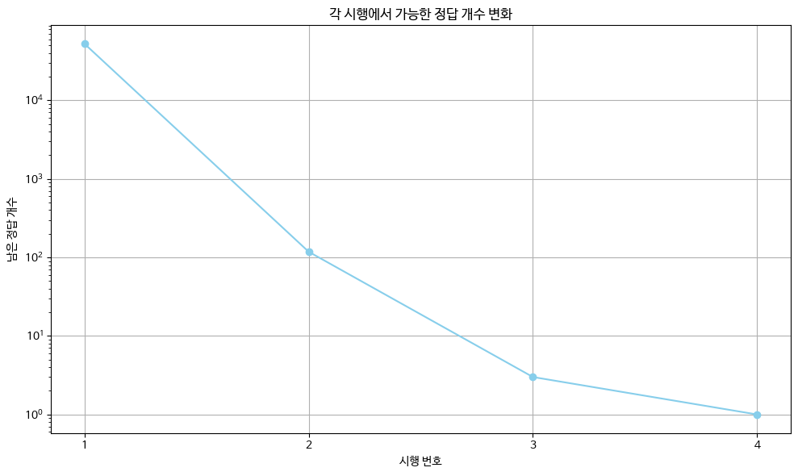
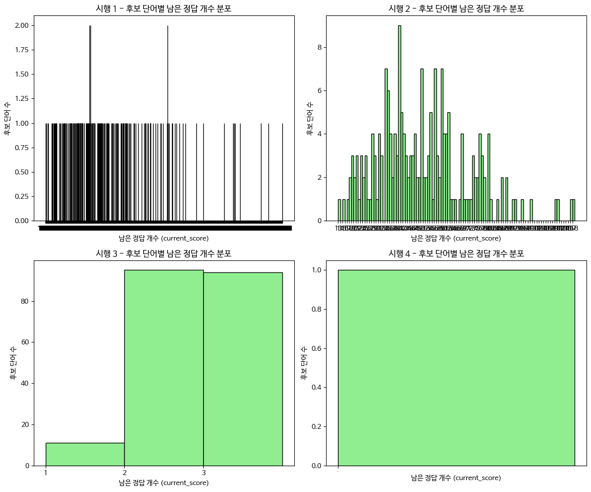
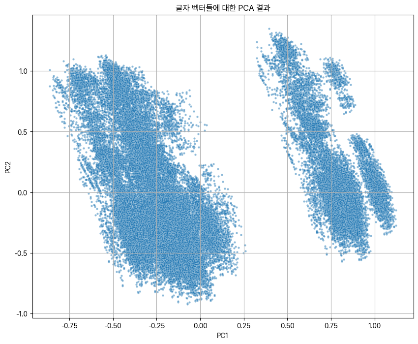
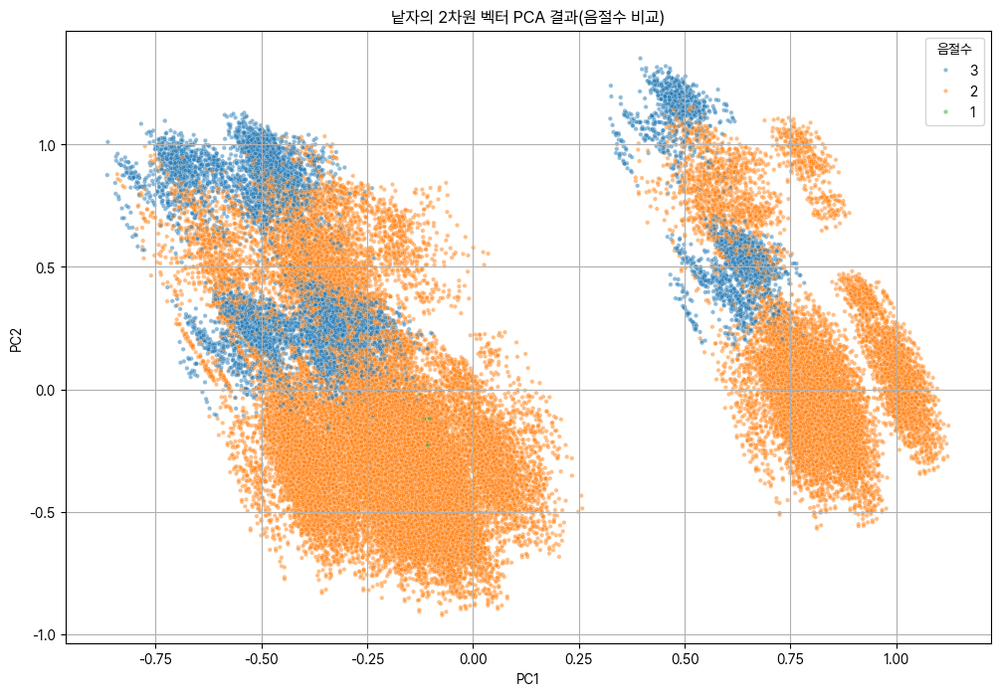
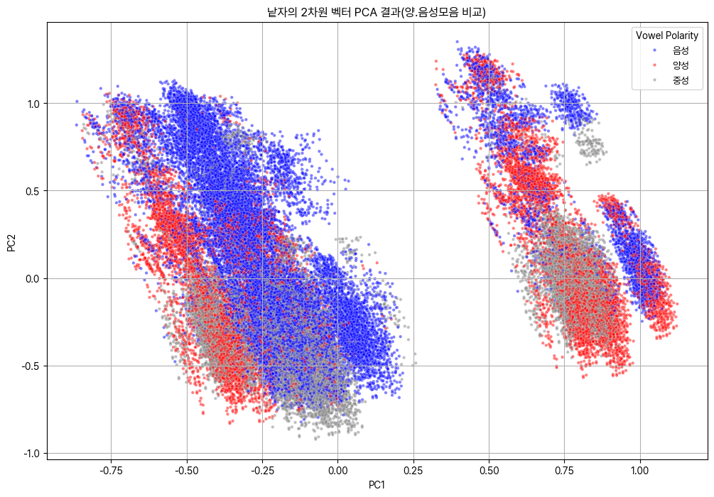

# 서론 (Introduction)

꼬들(Kordle)은 영어 단어 맞추기 게임 워들(Wordle)의 한글 버전 게임으로, 여섯 개의 자모로 풀어쓴 한글 단어 '꼬들'을 여섯 번의 도전 안에 맞히는 조합 탐색 게임이다. 게임을 시작하면 여섯 칸의 낱자 박스가 표시되어 각 칸에 한 낱자를 넣어 여섯 낱자짜리 단어를 입력해 넣을 수 있다. 입력한 후 답안을 제출했을때 입력한 자모의 위치가 일치한다면 초록색 피드백이 주어지고, 정답 단어에 존재하지만 위치가 다른 낱자라면 노란색 피드백이 주어지며, 자모가 단어에 포함되지 않을 때에는 회색 피드백으로 낱자가 표시된다. 게임의 목표는 주어지는 피드백들을 바탕으로 다음 답안을 추론하고, 이 과정에서 정답 단어를 가능한 한 빨리 추론하는 것이다.\
Kordle의 결과는 간단히 복사해 SNS에 공유할 수 있으며, 하루에 한 개의 문제가 출제되어 모든 사람이 똑같은 '오늘의 단어'를 빨리 맞추기 위하여 경쟁한다는 점에서 학교 친구들 사이에서 Kordle을 푸는 것이 유행이 되었고, 자연히 더 효율적으로 문제를 푸는 방식에 대하여 고민해보게 되며 효율적인 풀이를 위한 수학적 방법들을 찾아보게 되어 연구를 시작하기에 이르렀다.

<figure id="fig:kordle_share" data-latex-placement="H">

<figcaption>학급 SNS에 공유된 Kordle의 점수 공유 해시태그.</figcaption>
</figure>

수학적으로 모델링하기에 앞서 효율적 문제풀이 구조를 모델링하기 위해 친구들의 공통적 문제 풀이 패턴을 확인해 보니 가장 효율적으로 문제를 푸는 방법으로는 중복되는 자모를 줄이는 것, 그중에서도 시작 단어를 고를 때 낱자의 중복이 없는 단어를 선택함으로써 첫 피드백에서 가장 많은 정보를 얻을 수 있는 단어를 이용하는 것이 꼽혔다. 시작 단어는 아무런 정보도 없는 상태에서 단어에 대해서 주는 첫 번째 힌트이기에 \"ㄱㄱㅏㄱㄱㅏ\"와 같은 단어 대신 \"ㅅㅏㅇㄴㅕㅁ"과 같은 단어를 이용하는 등 중복되는 자모가 없는 단어를 고르는 나름의 방법대로 효율적으로 풀기 위한 방법이 있었으나, 이 뿐으로는 수학적 엄밀성이 결여되어 최적의 전략을 보장하지 못하기에 문제 해결의 효율성을 극대화하기 위해 수학적 모델링을 진행해 최적의 방법을 찾아보게 되었다.

본 보고서에서는 크게 세 가지의 모델을 다룬다. 단어의 구조적 속성을 기하학적으로 해석하여 각 단어를 다차원 벡터로 표현한 후 단어들의 집합의 통계적 중심점을 찾는 벡터 공간 모델, 불확실성을 확률론적으로 정량화하고 각 추측이 제공하는 정보의 기댓값을 극대화하는 것을 목표로 하는 정보 이론 모델, 그리고 마르코프 체인을 이용하여 정보 이론 모델을 개선하는 베이지안 모델로, 세 가지로 나누어 각 모델의 효과를 분석하였다. 이러한 서로 다른 세가지 모델들의 수학적 특성 차이가 실제 Kordle 게임 전략의 효율성에 어떤 영향을 미치는지, 특히 평균에 의존하는 벡터 모델과 최대 정보량 수득을 목표로 하는 엔트로피 모델의 근본적인 차이를 확인해 보겠다.

# 탐구질문 (Aim)

**Kordle과 같은 조합 탐색 문제에서 단어의 기하학적 구조에 집중하는 벡터 공간 모델과 정보의 불확실성 감소에 집중하는 정보 이론 모델, 베이즈 접근법 모델이라는 상이한 접근법을 비교 분석할 때, 모델들이 제시하는 최적 전략은 어떻게 다르며 그 수학적 가정과 결과의 차이는 무엇인가?** 를 탐구 질문으로 선정하였다.

# 연구방법 (Methodology)

## IAkordle 사이트 개설 및 단어 선정

연구에 앞서 Kordle 사이트와 흡사한 사이트를 직접 제작해 이용하였다. 기존 Kordle 게임 사이트는 하루에 정해진 한 문제만 풀 수 있어 분석을 진행하면서 원하는 단어들을 시험해 볼 수 없다는 제약이 있어 연구를 위해 게임을 처음부터 새로 구현하였다. 접근에 용이하도록 html과 js로 사이트를 제작해 코드 저장소인 github에 저장해둔 후, github에서 바로 사이트를 게시하였다. 게임에 이용되는 단어 모음집은 '사용 가능 단어 모음집'과 '답안 모음집' 두개로 준비하였다. 사용 가능 단어 모음집은 신어, 방언, 전문 용어 등 다양한 분야의 단어가 전부 담겨 있는 국립국어원의 개방 국어 사전, 우리말샘의 단어를 전부 추출해 사용하였고[@woorimal_ourimalssam], 답안 모음집으로는 Kordle 게임 제작자님께 2025년 8월 18일까지의 정답 단어 파일을 제공받아 분석에 활용하였다. 사전의 전체 단어는 2025년 8월 3일 업데이트본으로, 전체 1193504개의 단어들 중 게임에 해당하는, 유효한 6자모 단어 목록을 추출해 모든 단어를 현대 한글의 기본 자음 14개와 모음 10개, 총 24개의 개별 자모 단위로 분해하였다. 예를 들어, '삶'은 'ㅅ', 'ㅏ', 'ㄹ', 'ㅁ'으로, '없'은 'ㅇ', 'ㅓ', 'ㅂ', 'ㅅ'으로 처리하는 방식이다. 이를 위해서는 모든 단어들을 자음과 모음의 조합으로 나눈 다음, 게임의 규칙에 따라 쌍자음과 복합모음을 분리한 뒤 현재 입력할 수 없는 옛한글이 포함된 단어들을 빼고, '-ㄹ지면'이라는 단어와 같이 5음절 단어이지만 일반적인 단어가 아니며, 쌍자음이 아님에도 단어가 자음 두개로 시작해 일반적으로 유추 불가능한 단어도 제외하였다. 전부 추출한 결과, 해당하는 단어로는 57444개의 단어가 있었다. 두개의 단어 모음집을 이용해 출제되는 문제는 답안 모읍집에서만 출제하며, 문제를 풀때는 답안 모음집의 단어는 알지 못하고 사용 가능 단어 모음집은 확인할 수 있다는 가정 하에 진행하였다.

## 모델 1: 벡터 공간 모델

연구를 시작하며 고안한 첫번째 모델은 '벡터 공간 모델'로, 단어 벡터들의 산술 평균인 벡터의 무게중심에 가장 가까운 단어는 통계적으로 가장 흔한 자모 조합을 포함하므로, 게임 초반에 가장 많은 정보를 제공할 것이라는 아이디어로 각 단어들을 벡터에 나타낸 후 그 평균점을 구하였다. 각 자모를 차원 벡터로 표현해 가능한 모든 단어를 이용하여 단어에 대한 벡터들의 클러스터를 만든 후, 클러스터의 무게중심을 계산하며 평균 위치 벡터를 구한 후 해당 위치와의 값 차이로 각 단어의 기댓값을 나타내어 통계적으로 가장 흔한 자모 조합을 포함하는 단어를 찾는다. 이때, 분포의 가중치가 없기 때문에 밀도차가 존재하지 않아 centroid(도심)과 무게중심은 같으므로 본 보고서에서는 차이를 구분하지 않고 무게중심으로 표현하였다.\
사용된 모든 고유 한글 자모는 한글의 기본 자음 14개(ㄱ,ㄴ,ㄷ,ㄹ,ㅁ,ㅂ,ㅅ,ㅇ,ㅈ,ㅊ,ㅋ,ㅌ,ㅍ,ㅎ)와 모음 10개(ㅏ,ㅑ,ㅓ,ㅕ,ㅗ,ㅛ,ㅜ,ㅠ,ㅡ,ㅣ)를 합한 총 24개의 개별 자모를 기준으로 한다. 쌍자음(ㄲ,ㄸ,ㅃ,ㅆ,ㅉ)과 복합모음(ㅐ,ㅔ, ㅟ, ㅝ 등)은 게임 규칙에 따라 'ㄱ'+'ㄱ', 'ㅏ'+'ㅣ'와 같이 개별 자모의 조합으로 분리하여 처리하므로, 조건에 일치하는 24개의 낱자만을 바탕으로 벡터 공간을 구성하였다.

- **방법 1: 자모 기준 벡터 ($\mathbb{R}^{24}$):** 각 단어 $w$는 24차원 벡터 $\vec{w} \in \mathbb{R}^{24}$이며, 벡터의 각 성분은 각 자모의 등장 빈도의 의미를 가진다.

- **방법 2: 위치별 자모 벡터 ($\mathbb{R}^{144}$):** 모델의 정밀도를 높이기 위해, 위치 정보까지 포함한 $6 \times 24=144$차원의 벡터 공간을 구성한다. 이 공간에서 단어 $w$의 벡터 $\vec{w}$는 $w$의 각 위치 $p \in {1, \cdots, 6}$에 해당하는 자모 $j_i$에 대해, $p$와 $i$에 대응되는 각 차원들에 대한 크기, 기저 벡터 $\vec{e}_{p,i}$들의 합을 구한다.

단어 집합 $W$에 속한 모든 단어 벡터$w$들의 산술평균인 무게중심 벡터 $\vec{c}=\frac{\sum_{w} \vec{w}}{|W|}$를 구한다. 최적 시작 단어는 무게중심 벡터 $\vec{c}$와의 거리를 최소화하는 단어 $w$로 계산된다.

벡터에서 위치 벡터들의 무게중심을 구하는 공식은 일반적인 기댓값을 구하는 방식인 모든 값의 합을 값의 개수로 나누는 산술평균을 구하는 방식인 $\frac{1}{n}\times\sum_{i=1}^{n} x_i$과 동일한 $\vec{c}=\frac{1}{|W|}\times\sum_{w} \vec{w}$의 꼴을 띤다. 이는 벡터의 무게중심을 구하는 일을 기댓값을 구하는 방식인 평균을 구하는 방식을 벡터로 생각함으로써 산술적 계산을 기하학적으로 해석한 결과이다. 무게중심 벡터 $\vec{c}$ 자체는 여러 단어 벡터의 평균값이므로, 각 차원의 성분값이 정수가 아닌 실수 값을 가지며 $\vec{c}$는 실제 존재하는 단어에 해당하지 않을 것이다. 이 모델의 핵심 가정은 가장 대표적인, 평균적인 단어일수록 좋은 시작 단어라는 것이므로, 평균의 벡터 $\vec{c}$와 가장 유사한, 벡터 공간 내에서 가장 가까운 거리에 있는 실제 단어를 찾는 것이 최적의 선택지를 찾는 과정이 된다. 이 과정에서 가장 가까운 곳을 구하는 방법으로는 유클리드 거리 측정법을 이용했고, 근접도를 뒷받침하기 위해 유클리드 거리와 함께 코사인 유사도도 함께 구하였다.

1.  **유클리드 거리:** $$\sqrt{\sum_i (w_i - c_i)^2}$$\
    유클리드 거리는 벡터의 크기에 나타내는 거리 공식으로, IB 수학에서는 3차원 공간에 한해 크기를 구하였지만 이 문제에서는 차원이 3차원 이상이기에 차원을 확장하여 벡터의 각 차원을 모두 제곱한 후, 제곱들의 합의 제곱근을 구하였다. 이 보고서의 초기 벡터 모델 분석은 이 유클리드 거리를 기본으로 사용해 모델링하였지만, 모델의 값이 각 차원 차이의 제곱에 비례되게 도출되어 특정 차원에서 큰 차이를 보이는 이상치에 민감하게 반응할 수 있다는 단점이 있기 때문에 코사인 유사도 또한 구해 보았다.

2.  **코사인 유사도:** $$\frac{\vec{w} \cdot \vec{c}}{|\vec{w}| |\vec{c}|}$$ 두 벡터 사이 각도의 코사인 값으로, 벡터의 크기가 아닌 방향의 유사성을 측정한다. 이는 자모의 절대적 개수보다 구성 비율이 비슷한 단어를 찾는 데 더 효과적일 수 있어 유클리드 거리와 병행해 구해 보았다.\
    내적의 기본 공식을 생각하였을때, $\mathbb{R}^n$ 공간에서 두 벡터 $\vec{A}=(A_1, A_2, \cdots, A_n)$와 $\vec{B}=(B_1, B_2, \cdots, B_n)$가 주어졌을 때, 내적은 $\vec{A} \cdot \vec{B}=\sum_{i=1}^{n} A_i B_i=A_1 B_1 + A_2 B_2 + \dots + A_n B_n$로 계산하거나, 두 벡터의 크기와 그 사이의 각도 $\theta$를 이용하여 $\vec{A} \cdot \vec{B}=|\vec{A}| |\vec{B}| \cos(\theta)$로 정의할 수 있다. 이 식을 $\cos(\theta)$에 대해 식을 정리하면 다음과 같이 정리할 수 있다: $\cos(\theta)=\frac{\vec{w} \cdot \vec{c}}{|\vec{w}| |\vec{c}|}$ 이 $\cos(\theta)$ 값의 비교를 통하여 바로 코사인 유사도를 확인할 수 있다.

## 모델 2: 정보 이론 모델

벡터 모델의 한계를 느끼고 추가 탐구 확인하던 중 찾아낸 것이 정보 이론 모델이다. 정보 이론 모델은 개별 단어의 출현 빈도보다 추측을 통해 얻게 될 정보량의 기댓값을 구해 기댓값을 최대화하는 단어를 이용함으로써 Kordle 문제를 더 적은 횟수 안에 풀 수 있다는 아이디어이다[@3blue1brown_wordle_2022].

이 아이디어를 수학적으로 구현하기 위해, 먼저 정보량을 어떻게 측정할지 정의해야 한다. 어떤 사건의 정보량은 그 사건이 얼마나 기존과 차이가 있는지이기 때문에 발생 확률이 낮은 사건일수록 더 많은 정보를 담고 있다. 이러한 관계를 수학적으로 표현하기에 가장 적합한 함수가 로그 함수이다. 특정 단어 $x$가 정답일 확률을 $P(x)$라 할 때, 이 단어가 정답임을 알게 되었을 때 얻는 정보량 $I(x)$는 다음과 같이 정의할 수 있다. $$I(x)=\log_2\left(\frac{1}{P(x)}\right)=-\log_2 P(x)$$ 여기서 로그의 밑을 2로 사용하는 것은 정보량의 단위를 '비트(bit)'로 측정하기 위함이며, 확률$P(x) \le 1$이므로 $\log_2 P(x)$가 0 또는 음수 값을 가져 정보량을 양수로 만들기 위해 앞에 음수 부호를 붙인다.

엔트로피 $H$는 정보량의 기댓값이다. 기댓값은 변수 값 에 확률을 곱한 것을 모든 경우에 대해 더하여 구하므로, 엔트로피는 다음과 같이 자연스럽게 유도된다. $$H=E[I(X)]=E[-\log_2 P(X)]$$ 이를 전개하면, 섀넌의 엔트로피 공식이 된다[@shannon1948mathematical]. $$H=\sum_{x \in W} P(x) \cdot I(x)=-\sum_{x \in W} P(x) \log_2 P(x)$$

이 식을 통해 엔트로피를 계산해 최솟값을 찾는 과정은 앞 모델과 같이 기댓값을 구한다는 점은 같지만, 벡터로 구한 것과 같이 특정 단어의 확률을 기반으로 기댓값을 구하는 것이 아닌, 특정 단어를 추측했을 때 얻을 수 있는 정보량의 기댓값을 구한다는 점에서 차이가 있다. 단순한 단어의 빈도에 따른 기댓값이 아닌, 정보량에 기반한 기댓값을 구하는 과정에서 Kordle 게임의 색 피드백을 기반으로, 각 추측이 남은 가능한 단어 집합의 엔트로피를 얼마나 감소시키는지 분석함으로써 각 시행마다 알 수 있는 정보를 최대화하여 문제를 풂으로써, 일반적으로 단어들의 빈도에 의한 기댓값을 구하는 것보다 더 정밀하게 구할 수 있을 것으로 기대한다.

정답 후보 단어의 집합인 표본 공간 전체를 $W$로 정의하자. 여기서, 각 결과 $(x \in W)$의 확률을 $P(x)$라 할 때, 이산 확률 변수 $X$의 엔트로피는 다음과 같다. $$H=E[-\log_2 P(X)]=-\sum_{x \in W} P(x) \log_2 P(x)$$ 초기에는 아무런 주어진 정보가 없으므로 모든 단어가 정답일 확률이 동일한 균등 분포 $P_0(x)=\frac{1}{|W|}$라고 가정하면, 초기 엔트로피 $H(X)=\log_2(|W|)$가 되며 추후 특정 단어 $g$를 추측하게 되면 $3^6=729$개의 가능한 피드백 패턴 중 하나를 얻게 된다.

과정의 직접적 적용 전, 정답이 될 수 있는 단어의 집합 $W$가 아래 4개의 단어로만 구성된 상태를 가정해보자. $[ W=$ , , , $]$ 아무 정보가 없는 상태에서 각 단어가 정답일 확률은 동일하게 $\frac 1 4$이기에 초기 엔트로피는 다음과 같다: $$H(X)=-\sum_{i=1}^{4} P(x_i) \log_2 P(x_i)=-4 \times \left( \frac{1}{4} \log_2 \frac{1}{4} \right)=2 \text{ bits}$$ 정답을 구하기 위하여 2비트가 필요함을 알 수 있었다. 만약 첫 추측으로 후보군에 없는 'ㄴㅗㄴ'을 선택했다고 가정하자. 각 정답에 따라 받게 될 피드백(G: 초록, Y: 노랑, B: 회색)은 다음과 같이 2가지 패턴으로 나누어지고, 이 피드백에 따라 원래의 단어 집합 $(W)$는 다음과 같은 부분집합으로 나누어진다.

- ㅅㅏㄹ,ㅂㅏㄹ: $(f_A)$=(B, B, B) $\therefore W_{f_A}$=ㅅㅏㄹ, ㅂㅏㄹ

- ㅅㅗㄹ,ㄱㅗㄹ: $(f_B)$=(B, Y, B) $\therefore W_{f_B}$=ㅅㅗㄹ, ㄱㅗㄹ

각 피드백을 얻을 확률과 그 피드백을 받았을 때 남는 불확실성(엔트로피)을 계산하자.

- $f_A$: 나타날 확률 $(P(f_A) =\frac 1 2)$. 남은 후보가 2개이므로 이 그룹의 엔트로피는 $H(W_{f_A})=\log_2{2}=1$ 비트이다.

- $f_B$: 나타날 확률 $(P(f_B)=\frac 1 2)$. 남은 후보가 2개이므로 이 그룹의 엔트로피는 $H(W_{f_B})=\log_2{2}=1$ 비트이다.

추측 'ㄴㅗㄴ' 이후의 엔트로피 기댓값 $H(X|g=\text{`ㄴㅗㄴ'})$은 각 그룹 엔트로피의 가중 평균으로 계산된다. $$\begin{align*}
        H(X|g) &= \sum_{f} P(f) H(W_f) \\
        &= P(f_A)H(W_{f_A}) + P(f_B)H(W_{f_B}) \\
        &= (0.5 \times 1) + (0.5 \times 1)=1
\end{align*}$$

앞서 계산한 값들을 바탕으로, 특정 추측이 얼마나 많은 정보를 제공하는지 정량적으로 평가할 수 있다. 정보 이득$IG(g)$는 추측 전의 불확실성의 수치인 초기 엔트로피 $H(X)$에서, 추측 후 남게 될 불확실성의 기댓값인 기대 엔트로피 $H(X|g)$를 빼서 계산한다.

따라서 위 예시에서 'ㄴㅗㄴ'의 정보 이득은 다음과 같다. $$IG(g=\text{`ㄴㅗㄴ'}) = H(X) - H(X|g) = 2 - 1 = 1 \text{bit}$$ 이는 ㄴㅗㄴ이라는 단어를 추측함으로써 불확실성이 1비트만큼 감소했음을 의미한다. 정보 이론 모델의 목표는 정보 이득을 최대화하는 것으로, 이 과정에서 추측 가능한 모든 단어를 대상으로 각각의 정보 이득 $IG(g)$를 계산한 뒤, 그 값이 가장 큰 단어를 이번 차례의 최적의 추측 단어로 선택해 나가며 각 단계에서 불확실성을 가장 효율적으로 줄여나가는 최적의 방법을 구한다.

## 모델 3: 베이즈 정리를 이용한 모델 개선

모델 2는 모든 단어가 정답일 확률이 동일하다고 가정하는 한계가 있다. 실제 한글 단어는 무작위적인 자모의 조합이 아니라 일정한 구조와 패턴을 가지는데, 이러한 언어적 특성을 반영하기 위해 세번째 모델로는 단어의 구조적 확률을 모델링하는 1차 마르코프 연쇄 모델을 구축하여 사전 확률($P_w$)로 사용했다. 마르코프 연쇄는 특정 상태가 나타날 확률이 오직 직전 상태에만 의존한다는 '마르코프 속성'을 이용하는 확률 모델이다. 본 연구에서는 '특정 자모가 나타날 확률은 바로 이전 자모에만 영향을 받는다'고 가정하여 적용했다. 전체 단어 모음을 분석하여 확률을 계산했다. 균등 분포 가정을 넘어, 실제 단어 사용 빈도를 반영하기 위해 베이즈 정리를 적용하여 확률 모델을 동적으로 갱신하는 모델을 도입하였다.

- **사전 확률($P_w$):** 1차 마르코프 연쇄 모델을 통해 계산된 단어 $w$의 구조적 확률. 단어의 자모 배열이 통계적으로 얼마나 자연스러운지를 나타내는 값을 초기 확률 $P_w$로 사용한다.

- **사후 확률($P(w|F)$):** 특정 추측 $g$와 그에 대한 피드백 $f$라는 증거가 주어졌을 때, 각 후보 단어 $w$가 정답일 사후 확률 $P(w|F)$는 베이즈 정리를 통해 갱신할 수 있다. $$P(w|F)=\frac{P(F|w) P_w}{P(F)}$$

- **정규화 함수($P(F)$)**: 전체 확률의 법칙에 따라 계산되는 최종 값으로, 정리해 다음과 같이 나타난다: $$P(F)=\sum_{w_{temp} \in W} P(F|w_{temp}) P(w_{temp})$$

모델 2의 정보 이득 계산을 개선하기 위해 기대 엔트로피 $H(X|g)=\sum{f} P(f)
H(W_f)$를 계산할 때, 각 피드백 패턴 $f$가 나타날 확률 $P(f)$를 다음과 같이 재정의했다. 기존의 균등 분포 가정에서는 $P(f)$를 단순히 해당 그룹에 속한 단어의 개수의 비율($\frac{|W_f|}{|W|}$)로 계산했지만, 베이즈 모델에서는 이를 그룹 $W_f$에 속한 모든 단어들의 사전 확률($P_w$)의 합으로 계산했다. $$P(f)=\sum{w \in W_f} P_w$$ 이렇게 함으로써, 실제 사용 빈도가 높은 단어들을 포함하는 피드백 그룹에 더 높은 가중치를 부여하게 된다. 결과적으로 모델은 통계적으로 더 발생 가능성이 높은 결과에 초점을 맞춰 기대 엔트로피를 계산하고, 더 현실적인 정보 이득을 바탕으로 다음 추측을 선택한다.

# 본론 (Exploration)

## 모델 1: 벡터 공간 모델 분석

### 자모 빈도 벡터($\mathbb{R}^{24}$) 분석

$\mathbb{R}^{24}$ 공간에서 단어 집합의 무게중심 벡터 $\vec{c}$를 계산하고, 이와의 유클리드 거리가 가장 가까운 단어를 탐색했다.

   순위       단어       유클리드 거리 (s.f. 5)
  ------ -------------- ------------------------
    1     ㅇㅏㅇㅣㅇㅣ           1.3108
    2     ㅇㅏㅣㅇㅇㅏ           1.3108
    3     ㅇㅏㅣㅇㅇㅣ           1.3108
    4     ㅇㅏㅣㅇㅏㅣ           1.3108
    5     ㅇㅣㅇㅇㅏㅣ           1.3108

  : Python을 이용하여 전 단어에 대한 무게중심을 구한 후, 무게중심 벡터와 가장 가까운 단어

Python을 이용하여 전 단어에 대한 무게중심을 구한 후, 무게중심 벡터와 가장 가까운 거리에 존재하는 단어를 계산해 보았을 때, '아이이'라는 단어가 결과로 도출되었다. 이 정답은 처음 설정한 '단어의 중복이 최소화되어야 한다'는 생각과 전혀 다르게 'ㅇ'과 'ㅣ'의 반복으로, Kordle 풀이에서 단어의 효율성에 대한 의구심을 들게 하였다. 벡터상에서 무게중심이 가지는 의미를 생각해 보았을 때, 해당 단어가 가장 효율적인 단어가 아니라 통계적으로 가장 흔한 자모들의 조합으로 이루어진 단어의 의미를 가지고 있음을 깨달았고, 이런 단어가 선택된 이유는 단지 'ㅇ'과 'ㅣ'의 빈도가 높기 때문이라고 결론지었다. 음가가 없는 'ㅇ'이 한글 단어에서 매우 많이 이용되기 때문에 'ㅇ'의 빈도가 매우 높아 글자의 초성으로 많이 이용된 것으로, 모든 단어 벡터를 평균 낸 무게중심 벡터는 가장 흔한 자모들의 차원에서 높은 값을 갖게 될 것이고, 이는 선행 연구에서 이응이 각 자리별 빈도가 0.12 가량으로 가장 높았던 것으로 뒷받침되었다. 이 점을 해결하기 위하여 단순히 단어의 빈도수만 보는 것이 아닌 각 위치에 따른 자모의 빈도로, 각 자모의 위치 정보도 포함한 $6 \times 24=144$차원 벡터를 구상하여 만들어, 위와 같은 방식을 이용하여 무게중심을 다시 구하고, 그 무게중심에서 가장 가까운 단어를 찾아보았다.

### 위치별 자모 벡터($\mathbb{R}^{144}$) 분석

위치 정보를 보존하는 $\mathbb{R}^{144}$ 벡터 공간에서 같은 방식으로 무게중심을 계산했다.

[]{#tab:similarity_comparison label="tab:similarity_comparison"}

   **순위**     **단어**     **유클리드 거리 (s.f. 5)**   **코사인 유사도 (s.f. 4)**
  ---------- -------------- ---------------------------- ----------------------------
      1       ㅇㅏㄴㄱㅏㅣ             2.1202                       0.5469
      2       ㅇㅏㅇㅅㅏㅣ             2.1215                       0.5454
      3       ㅇㅏㅇㅈㅏㅣ             2.1222                       0.5447
      4       ㄱㅏㅇㅇㅏㅣ             2.1234                       0.5434
      5       ㄱㅏㅇㄱㅏㅣ             2.1241                       0.5426

  : 단어 유사도 순위 비교 {#tab:similarity_comparison}

그 결과 'ㅇㅏㄴㄱㅏㅣ'라는 훨씬 더 합리적으로 보이는 단어를 얻을 수 있었다. 이 단어는 'ㅇ', 'ㄴ', 'ㄱ' 등 중복이 적으면서도 사용 빈도가 가장 많은 3개의 자음으로 구성되었으며, 'ㅏ'와 'ㅣ' 등 빈도 높은 모음들로 구성되어 있다. 이 단어는 단순히 빈도가 높은 자모가 아닌, 해 공간을 가장 균등하게 분할하여 어떤 피드백이 나오더라도 남은 후보군의 엔트로피 기댓값을 최소화하는 데에 도움이 된다고 보인다. 중복되는 단어 'ㅏ'가 있었으나, 단어 분포를 보았을 때 'ㅏ'의 위치를 확실히 알 수 있는 것이 유리한 단어로 보였다. 위치 정보를 추가함으로써 모델이 단순히 자모의 총 빈도뿐만 아니라 위치별 평균 분포까지 계산되었지만, 이 역시 통계적 평균에 기반한 접근법으로, 최악의 경우를 고려하지 않고 평균적인 값을 구하는 것에서 수학적 의미에 그쳐 가장 효율적이라고 보장할 수 없다는 한계를 가졌다.

### 동적 벡터 모델을 이용한 전체 성능 측정

정적 벡터 모델은 아무런 정보도 없을 때 어떤 단어가 가장 효율적인지만을 계산해 최적의 시작 단어를 찾는 데 집중했지만, 정보 이론 모델과의 직접적인 성능 비교를 위해서 전체 게임 과정을 시뮬레이션했다. 이를 위해, 매 추측의 피드백을 반영하여 동적으로 다음 단어를 선택하는 '동적 벡터 모델'을 구현했다. 이 모델은 피드백과 일치하지 않는 단어들을 후보 목록에서 제외한 후, 남은 단어 집합의 무게중심을 다시 계산하고 그 중심에 가장 가까운 단어를 다음 추측으로 선택하는 과정을 정답을 찾을 때까지 반복했다. 그 결과 현재까지 정답이었던 꼬들 문항들인 1212개의 단어 목록을 대상으로 이 동적 모델의 성능을 시뮬레이션한 결과, 총 5863번의 추측이 이루어졌으며, 단어당 평균 추측 횟수는 $\frac{5863}{1212}\approx4.83745875$회로 계산되었다.

## 모델 2: 정보 이론 모델

### 최적 단어 도출 및 알고리즘의 동적 실행

정보 이득 계산 알고리즘을 C++로 그대로 구현하여 최적의 첫 추측 단어로 'ㅇㅏㄴㄱㅓㅣ'를 도출했다. 이 단어는 단순히 빈도가 높은 자모의 조합이 아닌, 해 공간을 가장 균등하게 분할하여 어떤 피드백이 나오더라도 남은 후보군의 엔트로피 기댓값을 최소화하는, 정보 이득을 최대화하는 단어이다.\
\
위는 '모델'이라는 단어를 찾기 위해 시뮬레이션을 한 결과이다. 평균적으로 4번에서 5번 만에 맞추는 모습을 볼 수 있었다. 이는 매 단계마다 남은 해 공간 $W$에 대해 정보 이득을 다시 계산하여 다음 추측을 동적으로 추천하는 알고리즘이다.

<figure id="fig:info_gain_eff" data-latex-placement="H">

<figcaption>정보 이득 기반 동적 단어 추천 알고리즘 시뮬레이션 결과</figcaption>
</figure>

Figure [2](#fig:info_gain_eff){reference-type="ref" reference="fig:info_gain_eff"}의 (a) 로그 스케일 그래프는 엔트로피가 거의 선형적으로 감소함, 즉 해 공간이 매 시행마다 기하급수적으로 감소함을 확인할 수 있었다. 그러나 Figure [2](#fig:info_gain_eff){reference-type="ref" reference="fig:info_gain_eff"}의 (b)는 정보 이득이 가장 큰 추측 단어를 사용하더라도, 운이 나쁜 피드백을 받을 경우 여전히 많은 수의 후보가 남을 수 있는 경우가 많았다. 이는 기대 정보 이득을 최대화하는 전략이 최악의 경우를 최소화하는 전략과 반드시 일치하지는 않음을 확인할 수 있었다. 벡터 모델과 같은 1212단어가 정답일 시 몇번만에 맞출 수 있는지 계산해 평균을 구해본 결과 벡터모델보다 훨씬 정확하게 전체 4689번의 추측으로 평균 $\frac{4689}{1212}\approx3.86881188$번 안에 맞추는 것을 볼 수 있었다. 이는 4번에 육박하는 수치로 벡터모델보다 대략 한 회차 더 빠르게 맞추는 것을 볼 수 있었다.

## 모델 3: 베이즈 정리를 이용한 모델 분석

베이즈 정리를 통해 마르코프 체인의 결과를 사전 정보를 통합한 모델의 성능을 비교한 결과 1212번의 추측 과정에서 4710번의 추측을 진행하며 평균적으로 $\frac{4710}{1212}\approx3.88613861$번의 시도 안에 답을 도출하는 것을 확인할 수 있었다. 결과적으로, 베이즈 갱신 모델이 가장 우수한 성능을 보였으나 그 향상 폭은 매우 미미했다. 이는 초기 해 공간이 $(M \approx 50000)$으로 매우 크기 때문에 사전확률인 개별 단어의 빈도가 제공하는 정보량이 해 공간을 분할하며 얻는 구조적 정보량에 비해 무시할 수 있을 정도로 작기 때문인 것으로 보인다. $P_w$의 미세한 차이가 전체 엔트로피 계산에 미치는 영향이 매우 적다는 것이다.

# 분석 및 논의 (Analysis & Discussion)

본 IA에서는 Kordle 문제에 대한 세 가지 핵심 전략, 기하학적 중심 탐색, 확률론적 정보 이득 탐색, 그리고 베이즈 정리의 도입에 대하여 분석하였다. 벡터 공간 모델은 계산이 빠르고 직관적이지만, 데이터의 통계적 편향에 취약하여 최적의 정보 수집 전략을 제공하지 못했다. 반면, 정보 이론 모델은 계산 비용이 높지만, 불확실성 감소를 직접적으로 모델링하여 훨씬 우수한 성능을 보인다는 것을 깨달았다. 베이즈 정리의 경우에는 모델의 특성으로 인해 효과적으로 정보 이론 모델과 차이를 보이는 데에는 미치지 못했다. 문제점 파악하기 위하여 가지고 있는 데이터가 어떤 경향성을 가지고 있었는지 우선적으로 파악해 보아야겠다고 생각들게 되었다.

### 정보 이득과 쿨백-라이블러 발산

쿨백-라이블러 발산(KL 발산)은 동일한 사건 공간에 대한 두 확률 분포의 차이를 측정하는 지표로, 하나의 분포를 기준으로 다른 분포를 표현하기 위해 얼마나 많은 추가 정보 비트가 필요한지를 정량화한다. 확률 분포 $P$와 $Q$가 주어졌을 때, $P$에 대한 $Q$의 KL 발산 $D_{KL}(Q || P)$은 다음과 같이 정의된다. $$D_{KL}(Q || P)=\sum_{x \in W} Q(x) \log_2 \frac{Q(x)}{P(x)}$$ Kordle 문제에서 정보 이득은 KL 발산의 기댓값과 같다. 여기서 $P(X)$는 추측 전의 사전 확률 분포이고, $P(X|f)$는 특정 피드백 $f$를 관찰한 후의 사후 확률 분포이다. 추측 $g$에 대한 정보 이득은 가능한 모든 피드백 $f$에 대해 사전 분포가 사후 분포로 변하면서 발생하는 KL 발산의 기댓값과 같다. $$IG(g)=E_f[D_{KL}(P(X|f) || P(X))]=\sum_f P(f) \sum_x P(x|f) \log_2 \frac{P(x|f)}{P(x)}$$ 따라서 정보 이득을 최대화하는 추측을 찾는 것이 평균적으로 사후 확률 분포와의 거리를 가장 크게 만들어 사전 확률 분포를 가장 크게 변화시키는 추측을 찾는 것과 수학적으로 가지고 있는 의미가 같다는걸 통해 정보 이득을 최소화하는 해법이 효과적임을 알 수 있다.

벡터 공간 모델의 핵심 가정이 가장 평균의 단어가 최적일 것이라는 기하학적 추측이었다면, 정보 이론 모델은 우리의 지식을 가장 크게 변화시키는 단어가 최적일 것이라는 확률론적 추측에 기반하는데, 이 지식의 변화량은 KL 발산을 통해 정량적으로 측정할 수 있다. Kordle 문제에서 우리의 '지식'은 각 단어가 정답일 확률을 나타내는 확률 분포로 볼 수 있다. 사전 확률 분포 $P(X)$는 추측하기 전 가지고 있는 초기 지식 상태, 그리고 사후 확률 분포 $P(X|f)$는 특정 단어를 추측하고 피드백 $f$를 받은 후 갱신된 지식 상태이다. KL 발산 $D_{KL}(P(X|f) || P(X))$는 이 두 확률 분포, 과거의 지식과 새로운 지식 사이의 거리를 측정한다. 그리고 정보 이득 $IG(g)$는 가능한 모든 피드백에 대한 이 거리의 기댓값과 같다.

$$IG(g)=E_f[D_{KL}(P(X|f) || P(X))]$$

이는 정보 이득을 최대화하는 단어를 찾는 것이 평균적으로 현재의 믿음인 사전 분포를 가장 크게 바꾸어 사후 분포와의 거리를 가장 크게 만드는 추측을 찾는 것과 수학적으로 완전히 동일한 의미를 가진다.

결론적으로 KL 발산은 두 모델의 철학적 차이와 연구 결과의 원인을 극명하게 보여준다. 벡터 모델은 단어 집합의 기하학적 중심을 찾지만 정보 이론 모델은 지식인 확률 분포의 변화를 가장 크게 일으킬 지점을 찾는다는 점에서 동시에 공통점과 차이점 모두를 지닌다는 점에서 한 회차정도 더 효율적으로 나왔을 것이다.

## 벡터 공간에서의 주성분 분석의 도입

벡터 모델의 한계를 확인해 보기 위하여 어떤 특징들이 크게 영향을 끼치는지 확인을 위하여 144차원의 위치별 자모 벡터 공간은 모든 데이터를 정밀하게 가지고 있었지만 지나치게 고차원 공간이었기 때문에 데이터 포인트들이 서로 멀리 흩어져 있어 무게중심과 같은 통계적 대표값의 의미가 희석될 수 있었으며, 그 의미를 파악하는데에도 쉽지 않았다. 이러한 문제를 해결하기 위해 데이터 차원 축소 기법인 주성분 분석(PCA)를 적용해 보았다. PCA는 고차원 데이터의 분산을 가장 잘 설명하는 새로운 직교 기저인 새 주성분을 찾는 방법이다.\

<figure id="fig:pca_result" data-latex-placement="H">

<figcaption>PCA 결과: 제1주성분과 제2주성분으로 시각화된 단어 벡터</figcaption>
</figure>

위는 PCA를 통해 $144$차원을 2차원으로 압축시킨 결과이다. 설명된 분산 비율은 8%가량으로 크지 않았는데, 그럼에도 도출된 산점도 그래프에서 값들이 일정 클러스터를 이루고 있는 모습은 볼 수 있었고, 한글의 특성에 따라 틀러스터가 분류된 것으로 보였다.

<figure id="fig:pca_results_combined" data-latex-placement="H">

<figcaption>PCA를 이용한 단어 군집 분석 결과</figcaption>
</figure>

Figure 4는 상기 주성분 분석된 그래프의 데이터들을 각각 음운의 개수와 극성에 따라서 색상을 입힌 결과이다. (a)에서 파란색은 2개의 음절, 초록색은 3개의 음절을 가진 단어들이고, 우측 (b)는 빨간색은 양성모음으로 이루어져 있는 단어, 파란색은 음성모음으로 이루어져 있는 단어, 회색은 중성모음 혹은 양성, 음성모음이 모두 있는 단어이다. 두 개의 큰 클러스터가 파란색으로 나타난 음성모음 단어들과 빨간색으로 나타난 양성 모음로 확실하게 나뉘어 있는 것을 확인할 수 있다. 대체로 세로로 빨간색, 파란색, 빨간색, 파란색 순서로 나누어져 있는 경향을 보이며 첫번째 주성분인 PC1의 값은 단어의 모음들의 극성의 영향을 받는다는 것을 볼 수 있었다. 중성모음 단어들과 혼합 단어들을 뜻하는 회색 점들은 양쪽 클러스터에 모두 퍼져 있으며, 특히 두 클러스터의 경계면과 오른쪽 클러스터의 특정 영역에 집중되어 있었다. 이는 회색 점들이 양성 모음과 음성 모음이 섞여 있어 '중성적'인 단어들을 의미하기 때문이다. 이 단어들이 두 클러스터의 경계에 위치하는 것이 자연스럽다. 음운 개수에 따라서는 클러스터가 가로로 위부터 3개, 2개, 3개, 2개의 개수를 가진 단어들로 배열되며 두번째 주성분인 PC2는 음운의 수에 따라 나누어짐을 확인하였다. PCA 분석을 통해서 각 방법들의 가치와 한계를 명확하게 확인할 수 있었다. 벡터 공간 모델에서 'ㅇㅏㅇㅣㅇㅣ'나 'ㅇㅏㄴㄱㅏㅣ'같이 비효율적인 단어를 제안한 것은 벡터 모델이 데이터의 분산이 가장 큰 축인 모음 조화 축을 따라 데이터의 평균점을 찾으려 했다. 하지만 이 평균점은 두 거대 군집의 어중간한 위치에 있을 뿐, Kordle 게임의 목표인 '정보 획득'과는 아무런 관련이 없었기 때문으로, PCA는 벡터 공간 모델이 문제를 풀기 위하여 도움이 되는 정보 이득이 아닌, 클러스터 중앙의 평균치만을 구하고 있어 정밀하지 못했음을 수학적으로 다시 한번 확인할 수 있었다. 반면, 정보 이론 모델이 찾아낸 'ㅇㅣㄱㅗㅏㄴ'은 양성 모음인 'ㅗ, ㅏ'와 중성 모음인 'ㅣ'을 모두 포함하고 있었다. 따라서 'ㅇㅣㄱㅗㅏㄴ'을 추측하며 PCA가 밝혀낸 두 개의 거대한 '모음 단어 공간' 중 정답이 어느 쪽에 속하는지를 한 번에 가장 효율적으로 확인할 수 있는, 가장 효율적인 최적의 질문이 될 수 있었을 것이다.

# 결론 (Conclusion)

본 연구는 Kordle로 대표되는 조합 탐색 문제에 대해 벡터 공간 모델과 정보 이론 모델을 비교 분석하여 단어당 평균 추측 횟수에서 약 4.84회의 추측 횟수만에 정답을 도출하는 벡터 모델이 약 3.87회의 추측에 정답을 도출하는 정보 이론 모델에 비해 낮은 효율을 보임으로써, 통계적 평균에 의존하는 기하학적 접근보다 불확실성 감소를 최대화하는 확률론적 접근이 훨씬 더 효율적인 전략임을 확인하였다. 통계적 평균에 의존하는 기하학적 모델보다 불확실성의 감소 기댓값을 최대화하는 확률론적 모델이 훨씬 더 효율적인 전략을 제공함을 입증하였다. 섀넌의 정보 이론은 문제 해결의 핵심이 가장 가능성 있는 추측이 아니라 가장 많은 정보를 주는 추측에 있음을 수학적으로 규명하는 강력한 도구임을 확인하였다. 또한, 베이즈 정리를 통한 모델 개선의 효과가 미미했던 결과는, 대규모 해 공간 문제에서 구조적 정보가 개별 확률 정보보다 우위에 있을 수 있다는 것을 확인할 수 있었다. 기하학적 모델 역시 PCA와 같은 차원 축소 기법을 통해 데이터의 숨겨진 구조를 발견하고 성능을 개선할 여지가 있음을 확인할 수 있었다. 모든 단어에 즉시 접근 가능하고 즉시 필터링해낼 수 있는 컴퓨터의 풀이와 사람이 생각해내서 푸는 것과는 차이가 있지만 이 수학적 분석을 통해서 컴퓨터로 가장 효율적인 모델 뿐만 아닌 사람이 어떻게 문제를 풀어야 할 지에 대해서도 아이디어를 얻을 수 있었다. 예를 들어, 정보 모델에서 확인할 수 있었듯이 게임 초반에는 정답 후보라고 생각되는 단어에 집착하기보다, 이전에 사용하지 않은 다양한 종류의 자모(특히 본 연구에서 정보 가치가 높게 나타난 'ㅇㅏㄴㄱㅓㅣ' 등)를 포함한 단어를 선택하여, 어떤 피드백이 나오든 최대한 많은 단어를 후보에서 제외하는 것이 오히려 효율적인 전략일 수 있다는, 기존 생각해보지 못한 문제풀이 방식을 확인할 수 있었다.

# 출처 (Bibliography)
- Sanderson, Grant. “Solving Wordle using information theory”, Feb. 2022, YouTube video (3Blue1Brown), www.youtube.com/watch?v=v68zYyaEmEA. Accessed 14 Aug. 2025.
- Shannon, Claude E. “A Mathematical Theory of Communication”. Bell System Technical Journal, vol. 27, no. 3, 1948, pp. 379–423. https://doi.org/10.1002/j.1538-7305.1948.tb01338.x.
- 국립국어원. “우리말샘 (개방 국어 사전)”, 2025, opendict.korean.go.kr/. Accessed 2 Aug. 2025.

